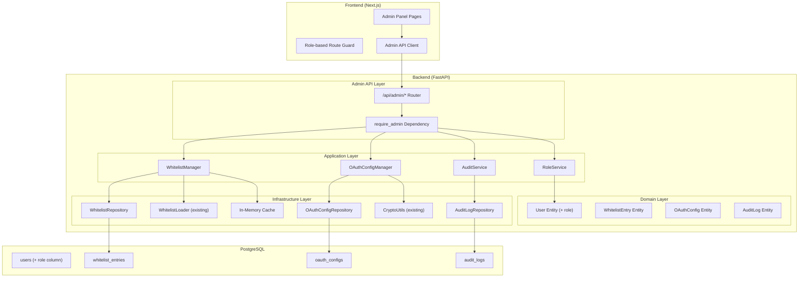

# Design Document: Admin Auth Management

## Overview

This design extends the existing Identity & Auth module in VroomHR with role-based access control, database-backed whitelist management, encrypted OAuth credential management, and an admin panel frontend. The architecture preserves backward compatibility with the existing file-based whitelist while introducing a layered admin subsystem within the `identity` module.

### Key Design Decisions

1. **Extend the existing `identity` module** rather than creating a separate `admin` module — the admin functionality is tightly coupled to authentication concerns (whitelist, OAuth, roles).
2. **Add a `role` column to the existing `users` table** via Alembic migration rather than a separate roles table — the requirement only specifies two roles (`admin`/`user`), making an enum column sufficient.
3. **Use a new `admin` sub-router** under `/api/admin/` with a shared `require_admin` dependency that checks the user's role.
4. **Merge file-based and database whitelist** using a composite `WhitelistManager` that unions both sources at query time.
5. **Store OAuth provider credentials in a new `oauth_configs` table** with AES-256-GCM encryption for secrets, reusing the existing `CryptoUtils`.
6. **Use an `audit_logs` table** with a JSON `details` column for flexible audit trail storage.

## Architecture



## Components and Interfaces

### Backend Components

#### 1. Domain Layer Extensions

**User Entity (modified)** — Add `role` field to existing `User` model:
```python
class UserRole(str, Enum):
    ADMIN = "admin"
    USER = "user"

class User(SQLModel, table=True):
    # ... existing fields ...
    role: UserRole = Field(default=UserRole.USER, nullable=False)
```

**WhitelistEntry Entity** — New domain entity:
```python
class WhitelistEntryType(str, Enum):
    EXACT_EMAIL = "exact_email"
    DOMAIN_PATTERN = "domain_pattern"

class WhitelistEntry(SQLModel, table=True):
    __tablename__ = "whitelist_entries"
    id: UUID
    value: str  # email or @domain.com
    entry_type: WhitelistEntryType
    added_by_user_id: UUID  # FK to users
    created_at: datetime
```

**OAuthConfig Entity** — New domain entity:
```python
class OAuthConfig(SQLModel, table=True):
    __tablename__ = "oauth_configs"
    id: UUID
    provider: str  # "google"
    client_id: str
    client_secret_enc: str  # AES-256-GCM encrypted
    redirect_uri: str
    is_active: bool
    created_at: datetime
    updated_at: datetime
    updated_by_user_id: UUID  # FK to users
```

**AuditLog Entity** — New domain entity:
```python
class AuditActionType(str, Enum):
    WHITELIST_ADD = "whitelist_add"
    WHITELIST_REMOVE = "whitelist_remove"
    OAUTH_UPDATE = "oauth_update"
    ROLE_CHANGE = "role_change"

class AuditLog(SQLModel, table=True):
    __tablename__ = "audit_logs"
    id: UUID
    admin_user_id: UUID  # FK to users
    admin_email: str
    action_type: AuditActionType
    details: dict  # JSON column with action-specific data
    created_at: datetime
```

#### 2. Application Layer

**RoleService** — Manages role assignments:
```python
class RoleService:
    async def promote_to_admin(self, target_user_id: UUID, admin_user: User) -> User
    async def demote_to_user(self, target_user_id: UUID, admin_user: User) -> User
    async def ensure_super_admin(self, email: str) -> None  # Called at startup
```

**WhitelistManager** — Composite whitelist with cache:
```python
class WhitelistManager:
    def __init__(self, file_loader: WhitelistLoader | None, repo: WhitelistRepository):
        self._cache: set[str] = set()
        self._cache_timestamp: float = 0

    def is_allowed(self, email: str) -> bool  # Checks both sources
    async def add_entry(self, value: str, entry_type: WhitelistEntryType, admin: User) -> WhitelistEntry
    async def remove_entry(self, entry_id: UUID, admin: User) -> None
    async def list_entries(self) -> list[WhitelistEntryResponse]
    async def refresh_cache(self) -> None
```

**OAuthConfigManager** — Manages OAuth credentials:
```python
class OAuthConfigManager:
    async def get_active_config(self) -> OAuthConfigResponse
    async def update_config(self, client_id: str, client_secret: str, redirect_uri: str, admin: User) -> OAuthConfigResponse
    async def validate_credentials(self, client_id: str) -> bool  # Test against Google discovery
    def get_effective_credentials(self) -> tuple[str, str, str]  # Returns active or env fallback
```

**AuditService** — Records admin actions:
```python
class AuditService:
    async def log_action(self, admin: User, action_type: AuditActionType, details: dict) -> AuditLog
    async def get_logs(self, page: int, page_size: int, action_type: str | None, start_date: datetime | None, end_date: datetime | None) -> PaginatedAuditLogs
```

#### 3. API Layer

**Admin Router** (`/api/admin/`):
```python
# Dependency
async def require_admin(current_user: User = Depends(get_current_user)) -> User:
    if current_user.role != UserRole.ADMIN:
        raise HTTPException(status_code=403, detail="Admin access required")
    return current_user

# Endpoints
POST   /api/admin/whitelist          # Add whitelist entry
DELETE /api/admin/whitelist/{id}      # Remove whitelist entry
GET    /api/admin/whitelist           # List all entries
POST   /api/admin/oauth/config       # Update OAuth credentials
GET    /api/admin/oauth/config       # Get current OAuth config (masked)
GET    /api/admin/users              # List all users with roles
PATCH  /api/admin/users/{id}/role    # Change user role
GET    /api/admin/audit-logs         # Get audit logs (paginated, filterable)
```

#### 4. Infrastructure Layer

**WhitelistRepository** — Database CRUD for whitelist entries:
```python
class WhitelistRepository:
    async def add(self, entry: WhitelistEntry) -> WhitelistEntry
    async def remove(self, entry_id: UUID) -> None
    async def get_all(self) -> list[WhitelistEntry]
    async def exists(self, value: str) -> bool
```

**OAuthConfigRepository** — Database CRUD for OAuth configs:
```python
class OAuthConfigRepository:
    async def get_active(self) -> OAuthConfig | None
    async def upsert(self, config: OAuthConfig) -> OAuthConfig
```

**AuditLogRepository** — Database CRUD for audit logs:
```python
class AuditLogRepository:
    async def create(self, log: AuditLog) -> AuditLog
    async def get_paginated(self, offset: int, limit: int, filters: dict) -> tuple[list[AuditLog], int]
```

### Frontend Components

#### Admin Route Guard
A middleware/layout component that checks the user's role from the `/api/auth/me` response and redirects non-admin users away from `/admin/*` routes.

#### Admin Pages
- `/admin/whitelist` — Whitelist management with table, add form, delete actions
- `/admin/oauth` — OAuth configuration display and update form
- `/admin/users` — User list with role management
- `/admin/audit-logs` — Audit log viewer with filters

#### Shared Components
- `AdminLayout` — Layout wrapper with admin navigation sidebar section
- `WhitelistTable` — Data table with shadcn/ui Table component
- `WhitelistAddForm` — Inline form with zod validation
- `OAuthConfigForm` — Form with masked secret display
- `UserRoleSelect` — Dropdown for role changes with confirmation
- `AuditLogTable` — Paginated table with date range and action type filters

## Data Models

### Database Schema Changes

#### Migration: Add `role` column to `users` table
```sql
ALTER TABLE users ADD COLUMN role VARCHAR(10) NOT NULL DEFAULT 'user';
CREATE INDEX ix_users_role ON users(role);
```

#### Migration: Create `whitelist_entries` table
```sql
CREATE TABLE whitelist_entries (
    id UUID PRIMARY KEY,
    value VARCHAR(255) NOT NULL,
    entry_type VARCHAR(20) NOT NULL,  -- 'exact_email' or 'domain_pattern'
    added_by_user_id UUID NOT NULL REFERENCES users(id),
    created_at TIMESTAMPTZ NOT NULL DEFAULT now(),
    CONSTRAINT uq_whitelist_value UNIQUE (value)
);
CREATE INDEX ix_whitelist_entries_value ON whitelist_entries(value);
CREATE INDEX ix_whitelist_entries_type ON whitelist_entries(entry_type);
```

#### Migration: Create `oauth_configs` table
```sql
CREATE TABLE oauth_configs (
    id UUID PRIMARY KEY,
    provider VARCHAR(50) NOT NULL DEFAULT 'google',
    client_id VARCHAR(255) NOT NULL,
    client_secret_enc TEXT NOT NULL,
    redirect_uri VARCHAR(500) NOT NULL,
    is_active BOOLEAN NOT NULL DEFAULT true,
    created_at TIMESTAMPTZ NOT NULL DEFAULT now(),
    updated_at TIMESTAMPTZ NOT NULL DEFAULT now(),
    updated_by_user_id UUID NOT NULL REFERENCES users(id),
    CONSTRAINT uq_oauth_config_provider_active UNIQUE (provider, is_active)
);
```

#### Migration: Create `audit_logs` table
```sql
CREATE TABLE audit_logs (
    id UUID PRIMARY KEY,
    admin_user_id UUID NOT NULL REFERENCES users(id),
    admin_email VARCHAR(255) NOT NULL,
    action_type VARCHAR(50) NOT NULL,
    details JSONB NOT NULL DEFAULT '{}',
    created_at TIMESTAMPTZ NOT NULL DEFAULT now()
);
CREATE INDEX ix_audit_logs_action_type ON audit_logs(action_type);
CREATE INDEX ix_audit_logs_created_at ON audit_logs(created_at);
CREATE INDEX ix_audit_logs_admin_user_id ON audit_logs(admin_user_id);
```

### API Schemas

```python
# Request schemas
class WhitelistAddRequest(BaseModel):
    value: str  # email or @domain pattern
    # entry_type is auto-detected from value format

class OAuthConfigUpdateRequest(BaseModel):
    client_id: str
    client_secret: str
    redirect_uri: HttpUrl

class RoleUpdateRequest(BaseModel):
    role: UserRole

# Response schemas
class WhitelistEntryResponse(BaseModel):
    id: UUID
    value: str
    entry_type: WhitelistEntryType
    added_by_email: str
    created_at: datetime
    source: Literal["database", "file"]  # Indicates origin
    is_readonly: bool  # True for file-based entries

class OAuthConfigResponse(BaseModel):
    client_id: str
    client_secret_masked: str  # e.g., "****abcd"
    redirect_uri: str
    updated_at: datetime
    updated_by_email: str

class AuditLogResponse(BaseModel):
    id: UUID
    admin_email: str
    action_type: AuditActionType
    details: dict
    created_at: datetime

class PaginatedAuditLogsResponse(BaseModel):
    items: list[AuditLogResponse]
    total: int
    page: int
    page_size: int
```

## Correctness Properties

*A property is a characteristic or behavior that should hold true across all valid executions of a system — essentially, a formal statement about what the system should do. Properties serve as the bridge between human-readable specifications and machine-verifiable correctness guarantees.*

### Property 1: Role-based access enforcement

*For any* user with a non-admin role attempting to access any admin API endpoint, the system SHALL return HTTP 403 Forbidden; and *for any* user with the admin role, the system SHALL grant access successfully.

**Validates: Requirements 1.1, 1.2**

### Property 2: Role field constraint

*For any* string value assigned to the user role field, the system SHALL accept only "admin" or "user" and reject all other values.

**Validates: Requirements 1.3**

### Property 3: Default role assignment

*For any* new user auto-provisioned via OAuth login (excluding the super admin email), the system SHALL assign the role "user".

**Validates: Requirements 1.4**

### Property 4: Whitelist entry addition

*For any* valid email address or valid domain pattern (format `@domain.tld`), when submitted by an admin, the Whitelist_Manager SHALL persist the entry in the database with the correct entry type classification.

**Validates: Requirements 3.1, 3.2**

### Property 5: Whitelist entry removal round-trip

*For any* whitelist entry that exists in the database, removing it SHALL result in the entry no longer being present in subsequent queries.

**Validates: Requirements 3.3**

### Property 6: Whitelist listing completeness

*For any* set of whitelist entries in the database, querying the list endpoint SHALL return all entries with their value, type, added-by email, and creation timestamp.

**Validates: Requirements 3.4**

### Property 7: Duplicate entry detection

*For any* whitelist entry value that already exists in the database, submitting the same value again SHALL result in an HTTP 409 Conflict response and the database state SHALL remain unchanged.

**Validates: Requirements 3.5**

### Property 8: Invalid input rejection

*For any* string that is neither a valid email address nor a valid domain pattern (format `@domain.tld`), submitting it as a whitelist entry SHALL result in an HTTP 422 response.

**Validates: Requirements 3.6**

### Property 9: Whitelist email matching

*For any* email address and any whitelist configuration containing exact emails and domain patterns, the matching function SHALL return true if and only if the email matches an exact entry (case-insensitive) OR the email's domain matches a domain pattern entry (case-insensitive).

**Validates: Requirements 4.1, 4.2, 4.3**

### Property 10: Whitelist source union

*For any* combination of file-based whitelist entries and database whitelist entries, the effective whitelist SHALL be the union of both sets — an email allowed by either source SHALL pass the whitelist check.

**Validates: Requirements 4.4, 9.2**

### Property 11: Deduplication with database precedence

*For any* entry that exists in both the file-based whitelist and the database, the listing SHALL contain exactly one entry for that value, and the metadata (added-by, timestamp) SHALL come from the database record.

**Validates: Requirements 9.3**

### Property 12: OAuth credential encryption round-trip

*For any* valid OAuth client_secret string, encrypting it with CryptoUtils and then decrypting the result SHALL produce the original string.

**Validates: Requirements 5.1**

### Property 13: Secret masking

*For any* client_secret string of length ≥ 4, the masked representation SHALL show only the last 4 characters prefixed with asterisks, and SHALL never expose the full secret.

**Validates: Requirements 5.2**

### Property 14: OAuth credential validation

*For any* OAuth configuration submission where client_id is empty OR redirect_uri is not a valid URL, the system SHALL reject the submission without persisting.

**Validates: Requirements 5.4**

### Property 15: Audit log completeness

*For any* admin action (whitelist add/remove, OAuth update, role change), the system SHALL create an audit log entry containing the admin's email, action type, timestamp, and action-specific details (without secret values).

**Validates: Requirements 5.6, 7.1, 7.2, 7.3**

### Property 16: Audit log query correctness

*For any* set of audit log entries and any combination of filters (action type, date range) with pagination parameters, the query SHALL return exactly the entries matching all filters, ordered by timestamp descending, with correct pagination metadata.

**Validates: Requirements 7.4**

## Error Handling

### Backend Error Handling

| Scenario | HTTP Status | Error Code | Response |
|----------|-------------|------------|----------|
| Non-admin accesses admin endpoint | 403 | `ADMIN_ACCESS_DENIED` | "Admin access required" |
| Duplicate whitelist entry | 409 | `WHITELIST_DUPLICATE` | "Entry already exists: {value}" |
| Invalid email/domain format | 422 | `WHITELIST_INVALID_FORMAT` | Validation error details |
| OAuth validation fails (Google) | 400 | `OAUTH_VALIDATION_FAILED` | "Could not verify credentials with Google" |
| OAuth client_id empty | 422 | `OAUTH_INVALID_CONFIG` | "client_id must not be empty" |
| OAuth redirect_uri invalid | 422 | `OAUTH_INVALID_CONFIG` | "redirect_uri must be a valid URL" |
| Target user not found (role change) | 404 | `USER_NOT_FOUND` | "User not found" |
| Cannot demote last admin | 400 | `ADMIN_LAST_ADMIN` | "Cannot remove the last administrator" |
| Super admin cannot be demoted | 400 | `ADMIN_SUPER_ADMIN_PROTECTED` | "Super admin role cannot be changed" |

### Frontend Error Handling

- API errors are displayed via `sonner` toast notifications
- Form validation errors are shown inline using `react-hook-form` + `zod`
- 403 responses on admin pages trigger redirect to main application
- Network errors show a retry-able error state

### Startup Error Handling

- If `AUTH_SUPER_ADMIN_EMAIL` is set but the user doesn't exist yet, the system logs an info message and will assign admin role on first login
- If no super admin email is configured and no admin exists, a WARNING is logged
- If the whitelist file doesn't exist but `AUTH_WHITELIST_FILE_PATH` is set, the system logs a warning and operates with database-only whitelist

## Testing Strategy

### Property-Based Testing (Backend)

The backend uses **Hypothesis** (already in dev dependencies) for property-based testing. Each correctness property maps to a Hypothesis test with minimum 100 iterations.

**Library**: `hypothesis>=6.100.0` (already configured in `pyproject.toml`)

**Test Configuration**:
- Minimum 100 examples per property test (`@settings(max_examples=100)`)
- Each test tagged with: `# Feature: admin-auth-management, Property {N}: {description}`

**Key test modules**:
- `tests/admin/test_whitelist_matching_properties.py` — Properties 9, 10, 11
- `tests/admin/test_whitelist_crud_properties.py` — Properties 4, 5, 6, 7, 8
- `tests/admin/test_role_properties.py` — Properties 1, 2, 3
- `tests/admin/test_oauth_properties.py` — Properties 12, 13, 14
- `tests/admin/test_audit_properties.py` — Properties 15, 16

### Unit Testing (Backend)

Example-based tests for:
- Super admin bootstrap scenarios (Req 2.1, 2.2, 2.3)
- OAuth credential fallback to env vars (Req 5.5)
- OAuth validation against Google discovery (Req 6.1, 6.2, 6.3)
- Cache invalidation timing (Req 3.7)
- Hot-reload of OAuth credentials (Req 5.3)

### Integration Testing (Backend)

- Full OAuth callback flow with whitelist check using merged sources
- Admin endpoint access control with real JWT tokens
- Database migration verification
- Cache refresh timing under load

### Frontend Testing

- **Vitest + fast-check** for any pure utility functions (masking, validation)
- **Example-based component tests** for admin panel pages (Req 8.1–8.8)
- Route guard redirect behavior for non-admin users

### Test Organization

```
backend/tests/
├── admin/
│   ├── test_whitelist_matching_properties.py
│   ├── test_whitelist_crud_properties.py
│   ├── test_role_properties.py
│   ├── test_oauth_properties.py
│   ├── test_audit_properties.py
│   ├── test_super_admin_bootstrap.py
│   ├── test_oauth_validation.py
│   └── test_cache_invalidation.py
frontend/src/
├── __tests__/
│   └── admin/
│       ├── whitelist-page.test.tsx
│       ├── oauth-page.test.tsx
│       ├── user-management.test.tsx
│       └── admin-guard.test.tsx
```
