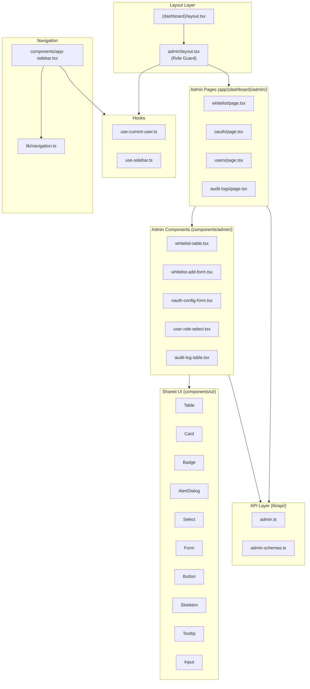
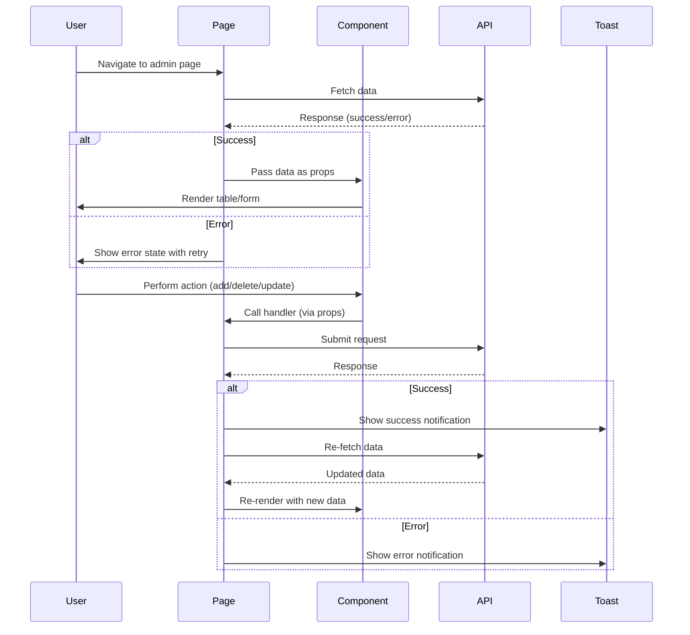

# Design Document: Admin Auth UI

## Overview

This design defines the complete frontend UI/UX architecture for the VroomHR admin authentication management panel. It covers four admin pages (Whitelist, OAuth, Users, Audit Logs) with responsive layouts, WCAG 2.1 AA accessibility compliance, consistent interaction patterns, and Vietnamese-language interface elements.

The design builds upon the existing partial implementation and specifies what needs to be added or modified for full requirements compliance. The backend API is already fully implemented (see `admin-auth-management` spec) — this design focuses exclusively on the frontend component architecture, state management, interaction patterns, and accessibility.

### Key Design Decisions

1. **Client-side rendering with `'use client'` directive** — All admin pages use client-side data fetching with `useState`/`useEffect` patterns, consistent with the existing implementation. Server Components are not used for admin pages because they require interactive state (loading, error, form state).
2. **Existing component library (shadcn/ui)** — Reuse the already-installed shadcn/ui primitives (Table, Card, Badge, AlertDialog, Select, Form, Input, Button, Skeleton, Tooltip) rather than introducing new UI libraries.
3. **react-hook-form + zod for form validation** — Consistent with the existing `WhitelistAddForm` and `OAuthConfigForm` patterns.
4. **sonner for toast notifications** — Already used throughout the existing implementation for success/error feedback.
5. **No global state management library** — Each page manages its own state via `useState`/`useCallback`. The only shared state is the current user (via `useCurrentUser` hook).
6. **Responsive design via Tailwind CSS breakpoints** — Using `sm:` (640px), `md:` (768px), `lg:` (1024px) prefixes for responsive layouts, consistent with the existing dashboard layout.
7. **Vietnamese language for all UI text** — All static labels, headings, descriptions, error messages, and button text use Vietnamese.

### Existing Implementation Status

| Component | Status | Gaps |
|-----------|--------|------|
| Admin layout (`admin/layout.tsx`) | ✅ Complete | None — role guard with loading state works correctly |
| App sidebar (`app-sidebar.tsx`) | ✅ Complete | None — admin nav section with collapsed tooltips |
| Whitelist page | ✅ Mostly complete | Missing: horizontal scroll on mobile, entry count in header |
| WhitelistTable | ✅ Mostly complete | Missing: `aria-label` on source badges, mobile horizontal scroll wrapper |
| WhitelistAddForm | ✅ Complete | Minor: could add focus return after successful add |
| OAuthConfigForm | ⚠️ Partial | Missing: Vietnamese text, `https://` validation, blur validation, placeholder text "Chưa cấu hình" |
| OAuth page | ⚠️ Partial | Missing: Vietnamese text, retry button styling |
| UserRoleSelect | ✅ Mostly complete | Missing: email in confirmation dialog description |
| Users page | ✅ Mostly complete | Missing: mobile column hiding, error state styling |
| AuditLogTable | ✅ Mostly complete | Missing: date range validation, mobile filter stacking, max-width on details column |
| Audit logs page | ✅ Complete | None |
| Navigation (`lib/navigation.ts`) | ✅ Complete | None |
| API client (`lib/api/admin.ts`) | ✅ Complete | None |
| Validation schemas (`admin-schemas.ts`) | ⚠️ Partial | Missing: `https://` requirement for redirect_uri |

## Architecture



### Data Flow Pattern

Each admin page follows the same data flow pattern:



## Components and Interfaces

### Page Components

#### WhitelistPage (`app/(dashboard)/admin/whitelist/page.tsx`)

**State:**
```typescript
interface WhitelistPageState {
  entries: WhitelistEntry[];
  loading: boolean;
  error: string | null;
}
```

**Responsibilities:**
- Fetch whitelist entries on mount and after mutations
- Coordinate add/delete operations between child components
- Display page header with entry count and refresh button
- Handle error states with retry capability

**Props passed to children:**
- `WhitelistAddForm`: `onAdd: (value: string) => Promise<void>`
- `WhitelistTable`: `entries`, `loading`, `onDelete: (id: string) => Promise<void>`

#### OAuthPage (`app/(dashboard)/admin/oauth/page.tsx`)

**State:**
```typescript
interface OAuthPageState {
  config: OAuthConfig | null;
  loading: boolean;
  error: string | null;
}
```

**Responsibilities:**
- Fetch OAuth config on mount
- Display current config in read-only card
- Provide update form with validation
- Handle loading/error states

#### UsersPage (`app/(dashboard)/admin/users/page.tsx`)

**State:**
```typescript
interface UsersPageState {
  users: AdminUser[];
  loading: boolean;
  error: string | null;
}
```

**Responsibilities:**
- Fetch user list on mount and after role changes
- Coordinate role change operations
- Display page header with refresh button
- Handle responsive column visibility

#### AuditLogsPage (`app/(dashboard)/admin/audit-logs/page.tsx`)

**State:**
```typescript
interface AuditLogsPageState {
  logs: AuditLog[];
  total: number;
  page: number;
  actionTypeFilter: string;
  startDate: string;
  endDate: string;
  loading: boolean;
}
```

**Responsibilities:**
- Fetch audit logs with pagination and filters
- Reset page to 1 when filters change
- Validate date range (end >= start)
- Coordinate filter/pagination state

### Admin Components

#### WhitelistTable

```typescript
interface WhitelistTableProps {
  entries: WhitelistEntry[];
  loading: boolean;
  onDelete: (id: string) => Promise<void>;
}
```

**Behavior:**
- Renders table with columns: Giá trị, Loại, Nguồn, Thêm bởi, Ngày thêm, Hành động
- Shows source badge with `aria-label` for accessibility
- Shows delete button only for database entries (non-readonly)
- Opens confirmation dialog before delete
- Shows loading/empty states
- Wraps in horizontal scroll container on mobile

#### WhitelistAddForm

```typescript
interface WhitelistAddFormProps {
  onAdd: (value: string) => Promise<void>;
}
```

**Behavior:**
- Inline form with text input + submit button
- Validates email/domain pattern format via zod schema
- Shows loading spinner during submission
- Clears input and returns focus on success
- Re-throws errors so page can handle toast

#### OAuthConfigForm

```typescript
interface OAuthConfigFormProps {
  config: OAuthConfig;
  onUpdated: (config: OAuthConfig) => void;
}
```

**Behavior:**
- Displays current config in read-only card (Client ID, masked secret, redirect URI)
- Shows source badge (Database/Environment)
- Provides update form with blur validation
- Shows backend errors in destructive alert banner
- Resets form on success
- Uses `type="password"` for client secret

#### UserRoleSelect

```typescript
interface UserRoleSelectProps {
  userId: string;
  userName: string;
  currentRole: UserRole;
  disabled?: boolean;
  onRoleChange: (userId: string, newRole: UserRole) => Promise<void>;
}
```

**Behavior:**
- Select dropdown with "admin"/"user" options
- Opens confirmation dialog on change
- Dialog describes promotion/demotion consequences
- Shows loading state during API call
- Reverts to original value on cancel or error

#### AuditLogTable

```typescript
interface AuditLogTableProps {
  logs: AuditLog[];
  total: number;
  page: number;
  pageSize: number;
  actionTypeFilter: string;
  startDate: string;
  endDate: string;
  loading?: boolean;
  onPageChange: (page: number) => void;
  onActionTypeChange: (actionType: string) => void;
  onStartDateChange: (date: string) => void;
  onEndDateChange: (date: string) => void;
}
```

**Behavior:**
- Filter section: action type dropdown, start date, end date
- Table with columns: Thời gian, Admin, Hành động, Chi tiết
- Action type shown as color-coded badge
- Details column truncated at 200px with title tooltip
- Pagination controls with disabled states
- Date range validation (end >= start)

### Validation Schemas

#### Updated `admin-schemas.ts`

```typescript
// Whitelist — existing, no changes needed
export const whitelistAddSchema = z.object({
  value: z.string()
    .min(3, "Giá trị phải có ít nhất 3 ký tự")
    .max(255, "Giá trị không được vượt quá 255 ký tự")
    .refine(
      (val) => isValidEmail(val) || isValidDomainPattern(val),
      { message: "Phải là email hợp lệ (user@domain.com) hoặc domain (@domain.com)" }
    ),
});

// OAuth — updated with https:// requirement
export const oauthConfigUpdateSchema = z.object({
  client_id: z.string()
    .min(1, "Client ID không được để trống")
    .max(255, "Client ID không được vượt quá 255 ký tự"),
  client_secret: z.string()
    .min(1, "Client Secret không được để trống")
    .max(500, "Client Secret không được vượt quá 500 ký tự"),
  redirect_uri: z.string()
    .min(1, "Redirect URI không được để trống")
    .max(500, "Redirect URI không được vượt quá 500 ký tự")
    .url("Redirect URI phải là URL hợp lệ")
    .refine(
      (val) => val.startsWith("https://"),
      { message: "Redirect URI phải bắt đầu bằng https://" }
    ),
});

// Role — existing, no changes needed
export const roleUpdateSchema = z.object({
  role: z.enum(["admin", "user"], {
    message: "Vai trò phải là 'admin' hoặc 'user'",
  }),
});
```

### Utility Functions

```typescript
// lib/utils/format.ts (or inline in components)

/** Format date to Vietnamese locale */
function formatDateVN(dateStr: string | null): string {
  if (!dateStr) return "—";
  return new Date(dateStr).toLocaleDateString("vi-VN", {
    day: "2-digit",
    month: "2-digit",
    year: "numeric",
    hour: "2-digit",
    minute: "2-digit",
  });
}

/** Get user initials from full name */
function getInitials(name: string): string {
  return name
    .split(" ")
    .map((part) => part[0])
    .filter(Boolean)
    .slice(0, 2)
    .join("")
    .toUpperCase();
}

/** Format audit log details object to readable string */
function formatDetails(details: Record<string, unknown>): string {
  const entries = Object.entries(details);
  if (entries.length === 0) return "—";
  return entries.map(([key, value]) => `${key}: ${String(value)}`).join(", ");
}
```

## Data Models

### Frontend Type Definitions (from `lib/api/admin.ts`)

```typescript
// Whitelist types
type WhitelistEntryType = "exact_email" | "domain_pattern";

interface WhitelistEntry {
  id: string | null;
  value: string;
  entry_type: WhitelistEntryType;
  added_by_email: string;
  created_at: string | null;
  source: "database" | "file";
  is_readonly: boolean;
}

interface WhitelistListResponse {
  items: WhitelistEntry[];
  total: number;
}

// OAuth types
interface OAuthConfig {
  client_id: string;
  client_secret_masked: string;
  redirect_uri: string;
  updated_at: string | null;
  source: string;
}

// User types
type UserRole = "admin" | "user";

interface AdminUser {
  id: string;
  email: string;
  name: string;
  avatar_url: string | null;
  role: UserRole;
  is_active: boolean;
  created_at: string;
  last_login: string;
}

// Audit log types
type AuditActionType = "whitelist_add" | "whitelist_remove" | "oauth_update" | "role_change";

interface AuditLog {
  id: string;
  admin_email: string;
  action_type: AuditActionType;
  details: Record<string, unknown>;
  created_at: string;
}

interface PaginatedAuditLogs {
  items: AuditLog[];
  total: number;
  page: number;
  page_size: number;
}
```

### API Endpoint Mapping

| Frontend Action | HTTP Method | Endpoint | Request Body | Response |
|----------------|-------------|----------|--------------|----------|
| List whitelist | GET | `/api/admin/whitelist` | — | `WhitelistListResponse` |
| Add whitelist entry | POST | `/api/admin/whitelist` | `{ value: string }` | `WhitelistEntryCreated` |
| Delete whitelist entry | DELETE | `/api/admin/whitelist/{id}` | — | 204 No Content |
| Get OAuth config | GET | `/api/admin/oauth/config` | — | `OAuthConfig` |
| Update OAuth config | POST | `/api/admin/oauth/config` | `{ client_id, client_secret, redirect_uri }` | `OAuthConfig` |
| List users | GET | `/api/admin/users` | — | `AdminUser[]` |
| Update user role | PATCH | `/api/admin/users/{id}/role` | `{ role: UserRole }` | `AdminUser` |
| Get audit logs | GET | `/api/admin/audit-logs?page&page_size&action_type&start_date&end_date` | — | `PaginatedAuditLogs` |


## Correctness Properties

*A property is a characteristic or behavior that should hold true across all valid executions of a system — essentially, a formal statement about what the system should do. Properties serve as the bridge between human-readable specifications and machine-verifiable correctness guarantees.*

### Property 1: Whitelist entry validation correctness

*For any* string that is a valid email address (matching `user@domain.tld` format) or a valid domain pattern (matching `@domain.tld` format), the whitelist add schema SHALL accept it; and *for any* string that matches neither format, the schema SHALL reject it.

**Validates: Requirements 4.2, 18.1**

### Property 2: OAuth configuration validation correctness

*For any* object where `client_id` is a non-empty string (≤255 chars), `client_secret` is a non-empty string (≤500 chars), and `redirect_uri` is a valid URL starting with `https://` (≤500 chars), the OAuth config update schema SHALL accept it; and *for any* object violating any of these constraints, the schema SHALL reject it with the appropriate field error.

**Validates: Requirements 7.3, 18.2, 18.5**

### Property 3: User initials derivation

*For any* non-empty name string, the `getInitials` function SHALL return a string of at most 2 uppercase characters, where each character is the first character of a space-separated name part, taken in order.

**Validates: Requirements 8.2**

### Property 4: Date formatting round-trip

*For any* valid ISO 8601 date string, the `formatDateVN` function SHALL return a non-empty string containing digits in `dd/MM/yyyy HH:mm` format using Vietnamese locale; and for a null input, it SHALL return the dash character "—".

**Validates: Requirements 8.6**

### Property 5: Date range validation

*For any* pair of date strings (startDate, endDate), if the parsed endDate is earlier than the parsed startDate, the date range validation SHALL reject the filter and prevent API submission; if endDate is equal to or later than startDate, the validation SHALL accept the filter.

**Validates: Requirements 10.9**

## Error Handling

### Error Display Strategy

| Error Type | Display Method | Behavior |
|-----------|---------------|----------|
| Data fetch failure (GET) | Error state in page (icon + message + retry) | Replaces content area, retry re-fetches |
| Form validation error (client-side) | Inline error below field (destructive text) | Clears when user modifies field |
| Form submission error (HTTP 400) | Destructive alert banner above form | Persists until form reset or new submission |
| Form submission error (HTTP 409/422) | Toast notification OR inline error | Toast for conflicts, inline for validation |
| Form submission error (HTTP 5xx) | Toast notification (auto-dismiss 5s) | Re-enables form controls |
| Network error (no response) | Toast notification | Message: "Lỗi kết nối mạng" |
| Session expired (HTTP 401) | Redirect to `/login` | Immediate redirect |
| Role revoked (HTTP 403) | Redirect to `/` | Immediate redirect |

### Error Handling by Page

**Whitelist Page:**
- Fetch error → Toast notification with error message
- Add success → Toast "Đã thêm '{value}' vào whitelist" + refresh table
- Add 409 → Toast "Mục này đã tồn tại trong whitelist"
- Add 422 → Inline error below input with backend message
- Delete success → Toast "Đã xóa mục khỏi whitelist" + refresh table
- Delete error → Toast with error message, dialog stays open

**OAuth Page:**
- Fetch error → Error state with icon + message + "Thử lại" link
- Update success → Toast "Đã cập nhật cấu hình OAuth" + update display + reset form
- Update 400 → Destructive alert banner above form (persists)
- Update 5xx → Toast with generic error message

**Users Page:**
- Fetch error → Error alert banner with message
- Role change success → Toast "Đã cập nhật vai trò thành công" + refresh list
- Role change 400 → Toast with specific error (last admin / super admin protected) + revert dropdown
- Role change 404 → Toast "Không tìm thấy người dùng" + refresh list

**Audit Logs Page:**
- Fetch error → Toast notification with error message
- Date range invalid → Inline validation error below date filters

### Global Error Interceptors

The API client (`lib/api/admin.ts`) handles HTTP status codes uniformly:
- **401**: Redirect to `/login` (session expired)
- **403**: Redirect to `/` (role revoked)
- **Other errors**: Extract `detail.message` or `detail` from response body, throw as Error

## Testing Strategy

### Testing Framework

- **Vitest** — Test runner (already configured in `frontend/vitest.config.ts`)
- **fast-check** — Property-based testing library (already in devDependencies)
- **@testing-library/react** — Component testing (to be added for component tests)

### Property-Based Tests

Each correctness property maps to a fast-check property test with minimum 100 iterations.

**Library**: `fast-check@^4.8.0` (already installed)

**Test Configuration:**
- Minimum 100 iterations per property test (fast-check default is 100)
- Each test tagged with: `// Feature: admin-auth-ui, Property {N}: {description}`

**Test file**: `frontend/src/__tests__/admin/admin-validation.property.test.ts`

| Property | Test Description | Generator Strategy |
|----------|-----------------|-------------------|
| Property 1 | Whitelist schema accepts valid emails/domains, rejects invalid | `fc.emailAddress()`, `fc.domain()` prefixed with `@`, `fc.string()` for invalid |
| Property 2 | OAuth schema validates field constraints | `fc.string()` with length constraints, `fc.webUrl()` for URIs |
| Property 3 | getInitials returns ≤2 uppercase chars from name parts | `fc.array(fc.string({minLength:1}), {minLength:1, maxLength:5}).map(parts => parts.join(' '))` |
| Property 4 | formatDateVN produces Vietnamese locale format or "—" | `fc.date()` mapped to ISO string, `fc.constant(null)` |
| Property 5 | Date range validation accepts valid ranges, rejects invalid | `fc.tuple(fc.date(), fc.date())` |

### Unit Tests (Example-Based)

**Test files:**
- `frontend/src/__tests__/admin/whitelist-table.test.tsx` — Table rendering, source badges, delete flow
- `frontend/src/__tests__/admin/whitelist-add-form.test.tsx` — Form submission, validation display
- `frontend/src/__tests__/admin/oauth-config-form.test.tsx` — Display, form validation, error handling
- `frontend/src/__tests__/admin/user-role-select.test.tsx` — Role change dialog, confirm/cancel
- `frontend/src/__tests__/admin/audit-log-table.test.tsx` — Filters, pagination, empty state
- `frontend/src/__tests__/admin/admin-layout.test.tsx` — Role guard, loading state, redirect

**Key scenarios per component:**
- Loading states render correctly
- Empty states display correct Vietnamese messages
- Error states show retry actions
- Confirmation dialogs open/close correctly
- Form submissions disable controls during loading
- Toast notifications fire on success/error
- Responsive classes are applied correctly
- ARIA attributes are present on interactive elements

### Accessibility Testing

- Verify `aria-label` on all icon-only buttons
- Verify `aria-hidden="true"` on decorative icons
- Verify `aria-describedby` links errors to inputs
- Verify focus trap in AlertDialog
- Verify `aria-live="polite"` on dynamic state changes
- Verify semantic landmarks (`nav`, `main`, `header`)
- Verify keyboard navigation order

### Test Organization

```
frontend/src/__tests__/admin/
├── admin-validation.property.test.ts    # Property-based tests (Properties 1-5)
├── whitelist-table.test.tsx             # WhitelistTable component tests
├── whitelist-add-form.test.tsx          # WhitelistAddForm component tests
├── whitelist-page.test.tsx              # WhitelistPage integration tests
├── oauth-config-form.test.tsx           # OAuthConfigForm component tests
├── oauth-page.test.tsx                  # OAuthPage integration tests
├── user-role-select.test.tsx            # UserRoleSelect component tests
├── users-page.test.tsx                  # UsersPage integration tests
├── audit-log-table.test.tsx             # AuditLogTable component tests
├── audit-logs-page.test.tsx             # AuditLogsPage integration tests
└── admin-layout.test.tsx                # AdminLayout role guard tests
```
