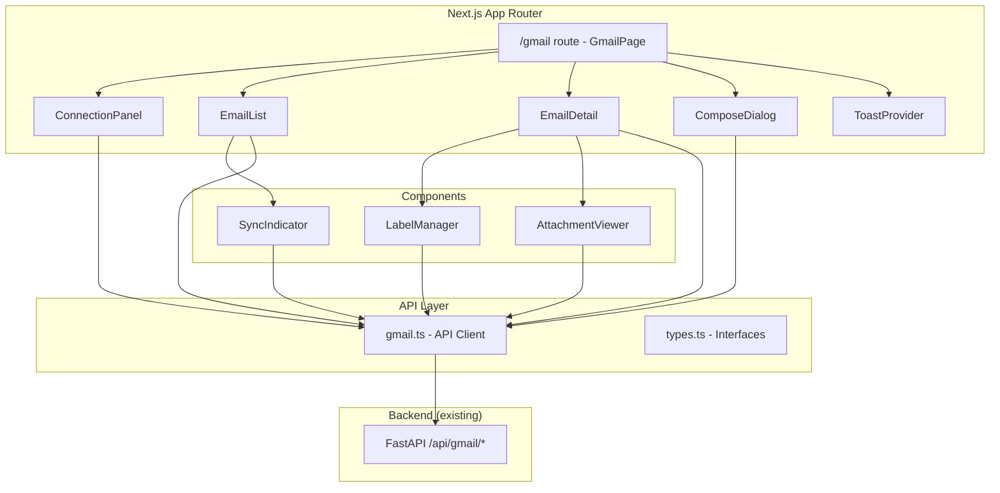
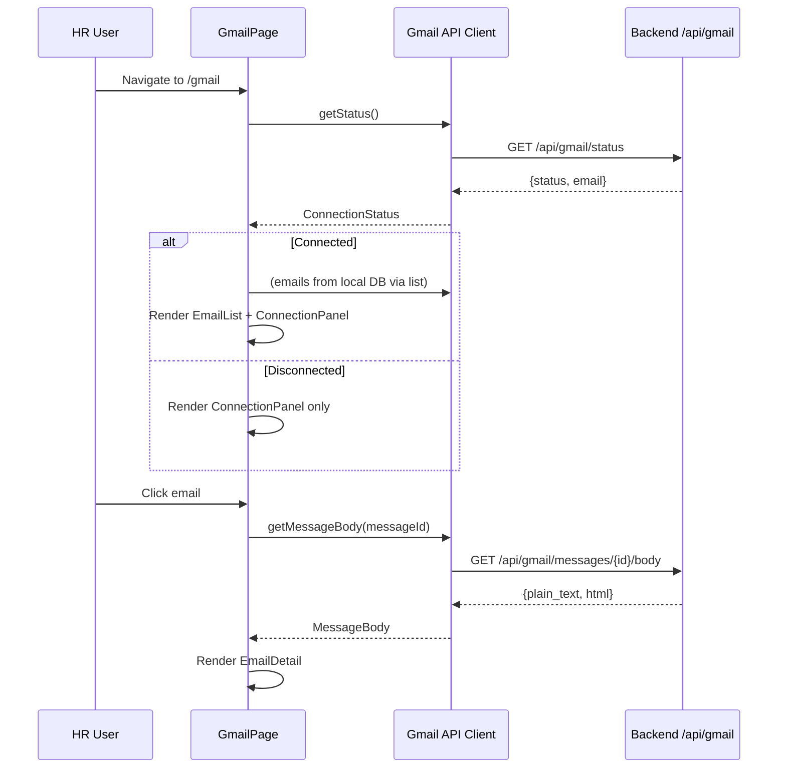

# Design Document: Gmail Frontend UI

## Overview

Module Gmail Frontend UI cung cấp giao diện người dùng cho tính năng Gmail Integration trong Vroom HR. Thiết kế này mô tả kiến trúc frontend bao gồm: routing, components, API client, state management, và responsive layout.

Frontend sử dụng stack hiện có: Next.js 14 (App Router), React 18, TypeScript, Tailwind CSS, lucide-react icons, và class-variance-authority cho component variants. API calls được proxy qua Next.js rewrites tới backend FastAPI tại `/api/gmail/*`.

### Key Design Decisions

1. **Client-side rendering ("use client")** — Giống pattern hiện tại của employees page, Gmail page sử dụng client components với `useState`/`useEffect` cho data fetching. Không cần server components vì data cần real-time refresh.
2. **No external state management library** — Sử dụng React local state + prop drilling (giống codebase hiện tại). Gmail page là self-contained nên không cần global state.
3. **Toast system tự build** — Project chưa có toast library. Implement lightweight toast context thay vì thêm dependency mới.
4. **Sandboxed HTML rendering** — Sử dụng `<iframe srcDoc>` với sandbox attribute để render email HTML an toàn, không cần thêm sanitization library.

## Architecture



### Data Flow



## Components and Interfaces

### Page Component

**File:** `frontend/src/app/(dashboard)/gmail/page.tsx`

```typescript
// GmailPage - Main page component
// Manages: connectionStatus, selectedEmail, emails[], composeOpen
// Responsive: two-panel (>=1024px) or single-panel (<1024px)
```

### Core Components

| Component | File | Responsibility |
|-----------|------|----------------|
| `ConnectionPanel` | `components/gmail/connection-panel.tsx` | Displays connection status, connect/disconnect buttons |
| `EmailList` | `components/gmail/email-list.tsx` | Renders email list with metadata, labels, attachment indicators |
| `EmailDetail` | `components/gmail/email-detail.tsx` | Full email view with body, metadata, reply button |
| `ComposeDialog` | `components/gmail/compose-dialog.tsx` | Modal for composing/replying emails |
| `LabelManager` | `components/gmail/label-manager.tsx` | Display/remove VroomHR labels on email |
| `AttachmentViewer` | `components/gmail/attachment-viewer.tsx` | List attachments with download |
| `SyncIndicator` | `components/gmail/sync-indicator.tsx` | Sync button with cooldown timer |
| `ToastProvider` | `components/gmail/toast-provider.tsx` | Toast notification context + renderer |

### Component Interfaces

```typescript
// ConnectionPanel
interface ConnectionPanelProps {
  status: ConnectionStatus | null;
  email: string | null;
  loading: boolean;
  error: string | null;
  onConnect: () => void;
  onDisconnect: () => void;
  onRetry: () => void;
  connectLoading: boolean;
  disconnectLoading: boolean;
}

// EmailList
interface EmailListProps {
  emails: EmailMessage[];
  selectedId: string | null;
  loading: boolean;
  onSelect: (email: EmailMessage) => void;
}

// EmailDetail
interface EmailDetailProps {
  email: EmailMessage | null;
  body: MessageBodyResponse | null;
  bodyLoading: boolean;
  bodyError: string | null;
  onReply: () => void;
  onRetryBody: () => void;
  onBack: () => void; // mobile back navigation
}

// ComposeDialog
interface ComposeDialogProps {
  open: boolean;
  onClose: () => void;
  replyTo?: {
    to: string;
    subject: string;
    messageId: string;
    originalBody?: string;
  };
  onSendSuccess: () => void;
}
```

### Sidebar Integration

Add Gmail nav item to the existing `navItems` array in `frontend/src/app/(dashboard)/layout.tsx`:

```typescript
import { Mail } from "lucide-react";

// Add after Positions item:
{ href: "/gmail", label: "Gmail", icon: Mail },
```

Active state logic already handles prefix matching via `pathname.startsWith(item.href)`.

## Data Models

### Frontend TypeScript Interfaces

```typescript
// --- Connection ---
type ConnectionStatus = "connected" | "disconnected" | "token_expired";

interface ConnectionStatusResponse {
  status: ConnectionStatus;
  email: string | null;
}

interface ConnectResponse {
  status: ConnectionStatus | null;
  redirect_url: string | null;
}

// --- Email Message (from local DB) ---
interface EmailMessage {
  id: string;
  gmail_message_id: string;
  gmail_thread_id: string;
  subject: string;
  sender_email: string;
  sender_name: string;
  recipient_emails: string[];
  cc_emails: string[];
  received_at: string; // ISO datetime
  snippet: string;
  label_ids: string[];
  has_attachments: boolean;
}

// --- Message Body ---
interface MessageBodyResponse {
  plain_text: string | null;
  html: string | null;
}

// --- Send Email ---
interface SendEmailRequest {
  to: string[];
  cc?: string[];
  subject: string;
  body_html?: string;
  body_text?: string;
  reply_to_message_id?: string;
}

interface SendEmailResponse {
  message_id: string;
  thread_id: string;
}

// --- Labels ---
interface LabelRemoveRequest {
  label_name: string;
}

// --- Sync ---
interface SyncResponse {
  synced_count: number;
  status: string;
}

// --- Attachments ---
interface AttachmentMetadata {
  attachment_id: string;
  filename: string;
  mime_type: string;
  size_bytes: number;
}

interface AttachmentsResponse {
  fetched_count: number;
  skipped_count: number;
  total_count: number;
  attachments: AttachmentMetadata[];
}
```

### Gmail API Client Module

**File:** `frontend/src/lib/api/gmail.ts`

Following the same pattern as `employees.ts` (using `fetch` + `handleResponse` helper):

```typescript
const BASE = "/api/gmail";

// Reuse handleResponse pattern from employees.ts
async function handleResponse<T>(res: Response): Promise<T> { ... }

export async function getStatus(): Promise<ConnectionStatusResponse> { ... }
export async function connect(): Promise<ConnectResponse> { ... }
export async function disconnect(): Promise<ConnectionStatusResponse> { ... }
export async function syncEmails(): Promise<SyncResponse> { ... }
export async function getMessageBody(messageId: string): Promise<MessageBodyResponse> { ... }
export async function removeLabel(messageId: string, labelName: string): Promise<void> { ... }
export async function sendEmail(data: SendEmailRequest): Promise<SendEmailResponse> { ... }
export async function getAttachments(messageId: string): Promise<AttachmentsResponse> { ... }
```

**Barrel export** in `frontend/src/lib/api/index.ts`:
```typescript
export * as gmailApi from "./gmail";
```

### Label Color Mapping

```typescript
const LABEL_COLORS: Record<string, { bg: string; text: string }> = {
  processed: { bg: "bg-gray-100", text: "text-gray-700" },
  recruitment: { bg: "bg-blue-100", text: "text-blue-700" },
  interview: { bg: "bg-orange-100", text: "text-orange-700" },
  onboarding: { bg: "bg-green-100", text: "text-green-700" },
};

// Extract category from label_id like "VroomHR/recruitment" → "recruitment"
function getLabelCategory(labelId: string): string | null {
  const match = labelId.match(/^VroomHR\/(.+)$/);
  return match ? match[1] : null;
}
```

### Relative Date Formatting

```typescript
function formatRelativeDate(isoDate: string): string {
  const date = new Date(isoDate);
  const now = new Date();
  const diffMs = now.getTime() - date.getTime();
  const diffMinutes = Math.floor(diffMs / 60000);
  const diffHours = Math.floor(diffMs / 3600000);
  const diffDays = Math.floor(diffMs / 86400000);

  if (diffMinutes < 1) return "Vừa xong";
  if (diffMinutes < 60) return `${diffMinutes} phút trước`;
  if (diffHours < 24) return `${diffHours} giờ trước`;
  if (diffDays === 1) return "Hôm qua";
  if (diffDays < 7) return `${diffDays} ngày trước`;
  return date.toLocaleDateString("vi-VN");
}
```

### File Size Formatting

```typescript
function formatFileSize(bytes: number): string {
  if (bytes < 1024) return `${bytes} B`;
  if (bytes < 1024 * 1024) return `${(bytes / 1024).toFixed(1)} KB`;
  return `${(bytes / (1024 * 1024)).toFixed(1)} MB`;
}
```

## Correctness Properties

*A property is a characteristic or behavior that should hold true across all valid executions of a system — essentially, a formal statement about what the system should do. Properties serve as the bridge between human-readable specifications and machine-verifiable correctness guarantees.*

### Property 1: Route active state matching

*For any* route string, the Gmail sidebar navigation item SHALL display active styling if and only if the route equals "/gmail" or starts with "/gmail/".

**Validates: Requirements 1.3**

### Property 2: Email list item rendering completeness

*For any* valid EmailMessage object, the Email_List component SHALL render: sender name, sender email, subject, snippet truncated to 100 characters, relative date, a paperclip icon if and only if `has_attachments` is true, and colored label badges for each VroomHR label present.

**Validates: Requirements 5.1, 5.3, 5.4**

### Property 3: Email list sorting invariant

*For any* list of EmailMessage objects, the Email_List SHALL render them in descending order of `received_at` (newest first).

**Validates: Requirements 5.2**

### Property 4: HTML content sandboxing

*For any* HTML string rendered in Email_Detail, the output SHALL NOT execute JavaScript (script tags, event handlers, javascript: URLs) and SHALL NOT load external resources (images, stylesheets, iframes from external origins).

**Validates: Requirements 7.2**

### Property 5: Plain text formatting preservation

*For any* plain text string containing newlines and whitespace, the Email_Detail SHALL preserve all line breaks and whitespace sequences in the rendered output.

**Validates: Requirements 7.3**

### Property 6: Email metadata rendering

*For any* EmailMessage with metadata (sender_name, sender_email, recipient_emails, cc_emails, subject, received_at), the Email_Detail SHALL display all fields with received_at formatted as dd/MM/yyyy HH:mm.

**Validates: Requirements 7.6**

### Property 7: Compose form validation

*For any* combination of To field value and Subject field value, the Send button SHALL be enabled if and only if the To field contains at least one valid email address (matching standard email regex) and the Subject field is non-empty.

**Validates: Requirements 8.7**

### Property 8: Reply subject prefix

*For any* email subject string, the reply compose SHALL set the subject to "Re: {subject}" if the subject does not already start with "Re: ", otherwise it SHALL keep the subject unchanged.

**Validates: Requirements 9.2**

### Property 9: Label color determinism

*For any* VroomHR label category, the Label_Manager and Email_List SHALL apply the deterministic color: processed→gray, recruitment→blue, interview→orange, onboarding→green.

**Validates: Requirements 5.4, 10.4**

### Property 10: Attachment metadata rendering

*For any* AttachmentMetadata object, the Attachment_Viewer SHALL display the filename, file size formatted as KB (< 1MB) or MB (≥ 1MB), and the correct MIME type icon (PDF icon for application/pdf, file-text for DOCX, image icon for JPEG/PNG).

**Validates: Requirements 11.1, 11.5**

### Property 11: Unauthorized redirect

*For any* API request from the Gmail_API_Client that returns HTTP 401, the Gmail_Page SHALL redirect the user to /login.

**Validates: Requirements 12.1**

### Property 12: Network error notification

*For any* API request from the Gmail_API_Client that fails with a network error (no response received), the Gmail_Page SHALL display a toast with the message "Không thể kết nối server. Vui lòng thử lại."

**Validates: Requirements 12.2**

## Error Handling

### API Error Strategy

| HTTP Status | Behavior |
|-------------|----------|
| 401 | Redirect to `/login` (token expired/invalid) |
| 400 | Display error message from response body in toast |
| 409 | Refresh connection status (Gmail not connected) |
| 429 | Display cooldown timer, disable sync button |
| 502 | Display "Retry" button in affected component |
| 5xx | Display error toast with generic message |
| Network error | Display toast: "Không thể kết nối server. Vui lòng thử lại." |

### Error Handling Implementation

The `handleResponse` function in `gmail.ts` will throw typed errors:

```typescript
class ApiError extends Error {
  constructor(
    public statusCode: number,
    public errorCode: string,
    message: string,
    public details?: Record<string, unknown>
  ) {
    super(message);
  }
}
```

The GmailPage component catches errors at the page level and routes them to appropriate handlers:
- 401 → `window.location.href = "/login"`
- Network errors → toast via ToastContext
- Component-specific errors → local error state in each component

### Optimistic UI with Rollback

For label removal (Requirement 10.2-10.3):
1. Immediately remove badge from UI
2. Call API in background
3. On failure: restore badge + show error toast

### Toast Notification Rules

- **Success toasts**: Auto-dismiss after 5 seconds (email sent, sync complete, disconnect success)
- **Error toasts**: Persist until manually dismissed by user clicking X
- **Position**: Top-right corner, stacked vertically
- **Max visible**: 3 toasts at a time

## Testing Strategy

### Unit Tests (Example-based)

Focus on specific scenarios and edge cases:
- Connection panel renders correctly for each status (connected, disconnected, token_expired)
- Compose dialog opens/closes correctly
- Confirmation dialog for disconnect
- Responsive layout breakpoint behavior
- Loading skeleton states
- Sync cooldown timer countdown
- OAuth flow redirect behavior

### Property-Based Tests

**Library:** [fast-check](https://github.com/dubzzz/fast-check) (TypeScript PBT library)

**Configuration:** Minimum 100 iterations per property test.

Each property test references its design document property:

```typescript
// Feature: gmail-frontend-ui, Property 1: Route active state matching
fc.assert(fc.property(
  fc.string(), // random route
  (route) => {
    const isActive = isGmailRouteActive(route);
    const expected = route === "/gmail" || route.startsWith("/gmail/");
    return isActive === expected;
  }
), { numRuns: 100 });
```

Properties to implement as PBT:
1. Route active state matching (Property 1)
2. Email list item rendering completeness (Property 2)
3. Email list sorting invariant (Property 3)
4. HTML content sandboxing (Property 4)
5. Plain text formatting preservation (Property 5)
6. Email metadata rendering with date format (Property 6)
7. Compose form validation logic (Property 7)
8. Reply subject prefix logic (Property 8)
9. Label color determinism (Property 9)
10. Attachment metadata rendering (Property 10)
11. Unauthorized redirect (Property 11)
12. Network error notification (Property 12)

### Integration Tests

- Full OAuth connect/disconnect flow with mocked backend
- Email list fetch → select → view body flow
- Compose and send email flow
- Sync with rate limiting behavior

### Test File Structure

```
frontend/src/__tests__/
  gmail/
    gmail-api-client.test.ts      # API client unit tests
    connection-panel.test.tsx     # Connection component tests
    email-list.test.tsx           # Email list rendering tests
    email-detail.test.tsx         # Email detail tests
    compose-dialog.test.tsx       # Compose/reply tests
    label-manager.test.tsx        # Label management tests
    attachment-viewer.test.tsx    # Attachment tests
    properties/
      route-matching.property.ts  # Property 1
      email-rendering.property.ts # Properties 2, 3
      html-sandbox.property.ts    # Property 4
      text-format.property.ts     # Property 5
      metadata.property.ts        # Property 6
      validation.property.ts      # Property 7
      reply-prefix.property.ts    # Property 8
      label-colors.property.ts    # Property 9
      attachments.property.ts     # Property 10
      error-handling.property.ts  # Properties 11, 12
```
