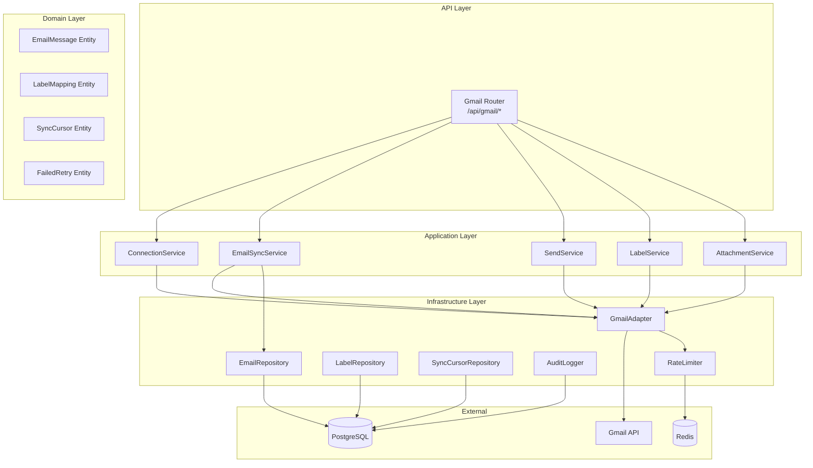
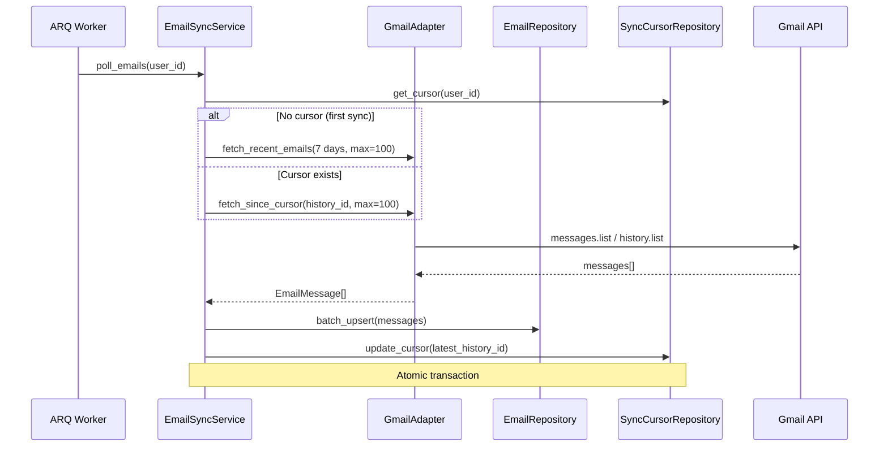
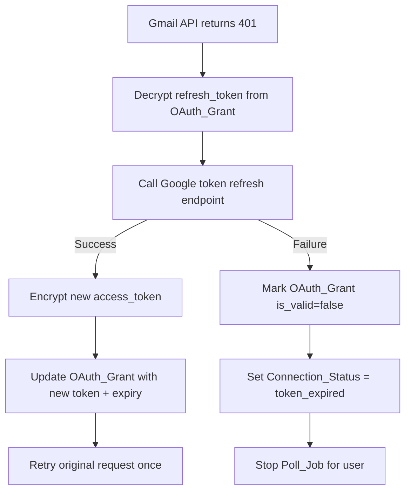
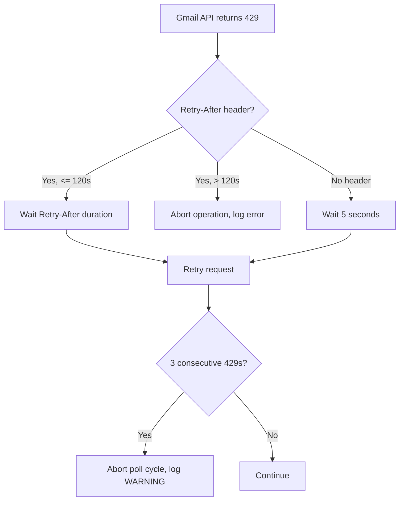

# Design Document: Gmail Integration

## Overview

Module Gmail Integration cung cấp khả năng kết nối Gmail của HR với hệ thống Vroom HR thông qua OAuth2, cho phép fetch email định kỳ, gửi email, quản lý labels, và xử lý attachments. Module này được thiết kế theo clean architecture hiện có của project (domain/application/infrastructure/api layers) và tận dụng OAuth_Grant infrastructure đã có từ Identity module.

### Key Design Decisions

1. **Tái sử dụng OAuth_Grant table**: Mở rộng scopes trên bản ghi hiện có thay vì tạo table mới cho Gmail tokens
2. **ARQ cron jobs**: Sử dụng ARQ (đã có trong stack) cho background polling thay vì celery
3. **Encryption reuse**: Tái sử dụng CryptoUtils (AES-256-GCM) từ Identity module cho raw_payload encryption
4. **Module isolation**: Gmail module nằm tại `backend/src/modules/gmail/` với DI container riêng
5. **Adapter pattern**: Gmail API interactions được đóng gói trong GmailAdapter infrastructure class

## Architecture

### High-Level Architecture




### Polling Architecture (ARQ Cron)



### Module Directory Structure

```
backend/src/modules/gmail/
├── __init__.py
├── container.py              # DI container (FastAPI Depends)
├── worker.py                 # ARQ cron job definitions
├── api/
│   ├── __init__.py
│   ├── router.py             # FastAPI endpoints /api/gmail/*
│   ├── schemas.py            # Pydantic request/response models
│   └── error_handler.py      # Exception → HTTP response mapping
├── application/
│   ├── __init__.py
│   ├── connection_service.py # OAuth connect/disconnect/status
│   ├── email_sync_service.py # Poll logic, manual sync
│   ├── send_service.py       # Email sending
│   ├── label_service.py      # Label CRUD and assignment
│   └── attachment_service.py # Attachment fetch and validation
├── domain/
│   ├── __init__.py
│   ├── entities.py           # EmailMessage, LabelMapping, SyncCursor, etc.
│   ├── exceptions.py         # Domain-specific exceptions
│   └── enums.py              # ConnectionStatus, EmailCategory enums
└── infrastructure/
    ├── __init__.py
    ├── config.py             # GmailSettings (pydantic-settings)
    ├── gmail_adapter.py      # Gmail API client wrapper
    ├── email_repository.py   # EmailMessage persistence
    ├── label_repository.py   # LabelMapping persistence
    ├── sync_cursor_repository.py
    ├── audit_logger.py       # Structured audit logging
    └── quota_tracker.py      # Redis-based quota tracking
```


## Components and Interfaces

### 1. GmailAdapter (Infrastructure)

Encapsulates all Gmail API interactions with built-in rate limiting, retry logic, and token refresh.

```python
class GmailAdapter:
    """Gmail API client wrapper with rate limiting and retry."""

    def __init__(
        self,
        settings: GmailSettings,
        crypto: CryptoUtils,
        quota_tracker: QuotaTracker,
        http_client: httpx.AsyncClient,
    ) -> None: ...

    async def fetch_messages(
        self, access_token: str, query: str | None, max_results: int = 100
    ) -> list[GmailMessageMetadata]: ...

    async def fetch_history(
        self, access_token: str, start_history_id: str, max_results: int = 100
    ) -> tuple[list[GmailMessageMetadata], str]: ...

    async def get_message_body(
        self, access_token: str, message_id: str
    ) -> MessageBody: ...

    async def send_message(
        self, access_token: str, mime_message: bytes
    ) -> SentMessageInfo: ...

    async def get_attachment(
        self, access_token: str, message_id: str, attachment_id: str
    ) -> bytes: ...

    async def modify_labels(
        self, access_token: str, message_ids: list[str],
        add_labels: list[str], remove_labels: list[str],
    ) -> None: ...

    async def batch_modify_labels(
        self, access_token: str, message_ids: list[str],
        add_labels: list[str], remove_labels: list[str],
    ) -> None: ...

    async def create_label(
        self, access_token: str, label_name: str
    ) -> str: ...

    async def list_labels(
        self, access_token: str
    ) -> list[GmailLabel]: ...

    async def revoke_token(self, token: str) -> bool: ...

    async def refresh_access_token(
        self, refresh_token: str
    ) -> tuple[str, datetime]: ...
```

### 2. ConnectionService (Application)

Manages Gmail OAuth2 connection lifecycle.

```python
class ConnectionService:
    """Manages Gmail OAuth2 connection status and lifecycle."""

    def __init__(
        self,
        settings: GmailSettings,
        oauth_grant_repo: OAuthGrantRepository,
        label_service: LabelService,
        gmail_adapter: GmailAdapter,
        crypto: CryptoUtils,
    ) -> None: ...

    async def get_status(self, user_id: UUID) -> ConnectionStatusResponse: ...
    async def initiate_connect(self, user_id: UUID) -> ConnectResponse: ...
    async def handle_callback(self, user_id: UUID, code: str) -> ConnectionStatusResponse: ...
    async def disconnect(self, user_id: UUID) -> ConnectionStatusResponse: ...
```


### 3. EmailSyncService (Application)

Handles periodic and manual email synchronization.

```python
class EmailSyncService:
    """Orchestrates email fetching from Gmail."""

    def __init__(
        self,
        gmail_adapter: GmailAdapter,
        email_repo: EmailRepository,
        sync_cursor_repo: SyncCursorRepository,
        oauth_grant_repo: OAuthGrantRepository,
        crypto: CryptoUtils,
        audit_logger: AuditLogger,
        settings: GmailSettings,
    ) -> None: ...

    async def poll_emails(self, user_id: UUID) -> int: ...
    async def manual_sync(self, user_id: UUID) -> int: ...
    async def _fetch_and_persist(
        self, user_id: UUID, access_token: str, cursor: SyncCursor | None
    ) -> int: ...
    async def _handle_token_refresh(self, user_id: UUID) -> str | None: ...
```

### 4. SendService (Application)

Handles email composition and sending.

```python
class SendService:
    """Composes and sends emails via Gmail API."""

    def __init__(
        self,
        gmail_adapter: GmailAdapter,
        email_repo: EmailRepository,
        oauth_grant_repo: OAuthGrantRepository,
        crypto: CryptoUtils,
        audit_logger: AuditLogger,
    ) -> None: ...

    async def send_email(self, user_id: UUID, params: SendEmailParams) -> SentEmailResponse: ...
    def _build_mime_message(self, params: SendEmailParams) -> bytes: ...
```

### 5. LabelService (Application)

Manages VroomHR label lifecycle on Gmail.

```python
class LabelService:
    """Manages VroomHR Gmail labels."""

    LABEL_PREFIX = "VroomHR/"
    REQUIRED_LABELS = ["processed", "recruitment", "interview", "onboarding"]

    def __init__(
        self,
        gmail_adapter: GmailAdapter,
        label_repo: LabelRepository,
        oauth_grant_repo: OAuthGrantRepository,
        crypto: CryptoUtils,
        audit_logger: AuditLogger,
    ) -> None: ...

    async def initialize_labels(self, user_id: UUID, access_token: str) -> None: ...
    async def add_label(self, user_id: UUID, message_id: str, label_name: str) -> None: ...
    async def remove_label(self, user_id: UUID, message_id: str, label_name: str) -> None: ...
    async def batch_add_label(
        self, user_id: UUID, message_ids: list[str], label_name: str
    ) -> None: ...
    def validate_namespace(self, label_name: str) -> bool: ...
```

### 6. AttachmentService (Application)

Handles attachment fetching and validation.

```python
class AttachmentService:
    """Fetches and validates email attachments."""

    ALLOWED_MIME_TYPES = frozenset({
        "application/pdf",
        "application/vnd.openxmlformats-officedocument.wordprocessingml.document",
        "image/jpeg",
        "image/png",
    })
    MAX_FILE_SIZE = 10 * 1024 * 1024  # 10MB
    MAX_ATTACHMENTS_PER_EMAIL = 20

    def __init__(
        self,
        gmail_adapter: GmailAdapter,
        oauth_grant_repo: OAuthGrantRepository,
        crypto: CryptoUtils,
        audit_logger: AuditLogger,
    ) -> None: ...

    async def fetch_attachments(
        self, user_id: UUID, message_id: str
    ) -> AttachmentResult: ...
    def validate_attachment(self, mime_type: str, size: int) -> bool: ...
```


### 7. QuotaTracker (Infrastructure)

Redis-based per-user quota tracking for Gmail API rate limits.

```python
class QuotaTracker:
    """Tracks Gmail API quota consumption per user using Redis sliding window."""

    QUOTA_LIMIT = 250  # units per user per second

    def __init__(self, redis_client: redis.Redis) -> None: ...

    async def consume(self, user_id: UUID, units: int) -> None: ...
    async def can_consume(self, user_id: UUID, units: int) -> bool: ...
    async def wait_if_needed(self, user_id: UUID, units: int) -> None: ...
```

### 8. AuditLogger (Infrastructure)

Structured audit logging for Gmail operations.

```python
class AuditLogger:
    """Logs Gmail operations for audit trail."""

    def __init__(self, session: AsyncSession) -> None: ...

    async def log_operation(
        self,
        operation_type: str,
        user_id: UUID,
        message_count: int = 0,
        success: bool = True,
        metadata: dict | None = None,
    ) -> None: ...

    async def log_send(
        self,
        user_id: UUID,
        recipient_emails: list[str],
        subject: str,
        template_name: str | None = None,
    ) -> None: ...
```

### 9. ARQ Worker Configuration

```python
# backend/src/modules/gmail/worker.py

async def poll_gmail_emails(ctx: dict) -> None:
    """ARQ cron job: fetch new emails for all connected users."""
    ...

class WorkerSettings:
    """ARQ worker settings for Gmail polling."""
    cron_jobs = [
        cron(poll_gmail_emails, second={0}, minute=set(range(0, 60, 5)))
    ]
    redis_settings = RedisSettings(...)
```

## Data Models

### New Database Tables

#### email_messages

| Column | Type | Constraints | Description |
|--------|------|-------------|-------------|
| id | UUID | PK | Internal ID |
| user_id | UUID | FK → users.id, NOT NULL, INDEX | Owner HR user |
| gmail_message_id | VARCHAR(255) | UNIQUE, NOT NULL, INDEX | Gmail message ID |
| gmail_thread_id | VARCHAR(255) | NOT NULL, INDEX | Gmail thread ID |
| subject | VARCHAR(998) | NOT NULL, DEFAULT '' | Email subject (truncated) |
| sender_email | VARCHAR(255) | NOT NULL, DEFAULT '' | From address |
| sender_name | VARCHAR(255) | NOT NULL, DEFAULT '' | From display name |
| recipient_emails | JSONB | NOT NULL | List of To addresses (max 50) |
| cc_emails | JSONB | NOT NULL, DEFAULT '[]' | List of CC addresses (max 50) |
| received_at | TIMESTAMPTZ | NOT NULL | Original email date |
| snippet | VARCHAR(200) | NOT NULL, DEFAULT '' | Preview text |
| label_ids | JSONB | NOT NULL, DEFAULT '[]' | Current Gmail label IDs |
| has_attachments | BOOLEAN | NOT NULL, DEFAULT false | Attachment flag |
| raw_payload_enc | TEXT | NULL | AES-256-GCM encrypted raw payload |
| processing_status | VARCHAR(20) | NOT NULL, DEFAULT 'unprocessed' | unprocessed/processed/failed |
| category | VARCHAR(20) | NULL | recruitment/interview/onboarding |
| retry_count | INTEGER | NOT NULL, DEFAULT 0 | Consecutive fetch failure count |
| is_permanently_failed | BOOLEAN | NOT NULL, DEFAULT false | Excluded from retries |
| created_at | TIMESTAMPTZ | NOT NULL, DEFAULT now() | Record creation time |
| updated_at | TIMESTAMPTZ | NOT NULL, DEFAULT now() | Last update time |


#### sync_cursors

| Column | Type | Constraints | Description |
|--------|------|-------------|-------------|
| id | UUID | PK | Internal ID |
| user_id | UUID | FK → users.id, UNIQUE, NOT NULL | One cursor per user |
| history_id | VARCHAR(50) | NOT NULL | Gmail history ID for incremental sync |
| last_poll_at | TIMESTAMPTZ | NOT NULL | Last successful poll timestamp |
| created_at | TIMESTAMPTZ | NOT NULL, DEFAULT now() | Record creation time |
| updated_at | TIMESTAMPTZ | NOT NULL, DEFAULT now() | Last update time |

#### gmail_label_mappings

| Column | Type | Constraints | Description |
|--------|------|-------------|-------------|
| id | UUID | PK | Internal ID |
| user_id | UUID | FK → users.id, NOT NULL, INDEX | Owner HR user |
| label_name | VARCHAR(100) | NOT NULL | VroomHR label name (e.g., "VroomHR/processed") |
| gmail_label_id | VARCHAR(255) | NOT NULL | Gmail's internal label ID |
| is_initialized | BOOLEAN | NOT NULL, DEFAULT false | Label creation confirmed |
| created_at | TIMESTAMPTZ | NOT NULL, DEFAULT now() | Record creation time |
| updated_at | TIMESTAMPTZ | NOT NULL, DEFAULT now() | Last update time |

**Unique constraint**: (user_id, label_name)

#### email_attachments

| Column | Type | Constraints | Description |
|--------|------|-------------|-------------|
| id | UUID | PK | Internal ID |
| email_message_id | UUID | FK → email_messages.id, NOT NULL, INDEX | Parent email |
| gmail_attachment_id | VARCHAR(255) | NOT NULL | Gmail attachment ID |
| filename | VARCHAR(255) | NOT NULL | Original filename |
| mime_type | VARCHAR(100) | NOT NULL | MIME type |
| size_bytes | INTEGER | NOT NULL | File size in bytes |
| storage_path | VARCHAR(500) | NULL | Path in object storage (if stored) |
| created_at | TIMESTAMPTZ | NOT NULL, DEFAULT now() | Record creation time |

#### gmail_audit_logs

| Column | Type | Constraints | Description |
|--------|------|-------------|-------------|
| id | UUID | PK | Internal ID |
| user_id | UUID | FK → users.id, NOT NULL, INDEX | Acting user |
| operation_type | VARCHAR(50) | NOT NULL | fetch/send/label_modify/connect/disconnect |
| message_count | INTEGER | NOT NULL, DEFAULT 0 | Messages affected |
| success | BOOLEAN | NOT NULL | Operation outcome |
| metadata | JSONB | NULL | Additional context (no body/snippet/attachment data) |
| created_at | TIMESTAMPTZ | NOT NULL, DEFAULT now(), INDEX | Timestamp (for retention queries) |

### Domain Entities (SQLModel)

```python
class EmailMessage(SQLModel, table=True):
    __tablename__ = "email_messages"

    id: UUID = Field(default_factory=uuid4, primary_key=True)
    user_id: UUID = Field(foreign_key="users.id", nullable=False, index=True)
    gmail_message_id: str = Field(max_length=255, unique=True, nullable=False, index=True)
    gmail_thread_id: str = Field(max_length=255, nullable=False, index=True)
    subject: str = Field(default="", max_length=998, nullable=False)
    sender_email: str = Field(default="", max_length=255, nullable=False)
    sender_name: str = Field(default="", max_length=255, nullable=False)
    recipient_emails: list[str] = Field(default_factory=list, sa_column=Column(JSONB, nullable=False))
    cc_emails: list[str] = Field(default_factory=list, sa_column=Column(JSONB, nullable=False))
    received_at: datetime = Field(sa_column=Column(DateTime(timezone=True), nullable=False))
    snippet: str = Field(default="", max_length=200, nullable=False)
    label_ids: list[str] = Field(default_factory=list, sa_column=Column(JSONB, nullable=False))
    has_attachments: bool = Field(default=False, nullable=False)
    raw_payload_enc: str | None = Field(default=None)
    processing_status: str = Field(default="unprocessed", max_length=20, nullable=False)
    category: str | None = Field(default=None, max_length=20)
    retry_count: int = Field(default=0, nullable=False)
    is_permanently_failed: bool = Field(default=False, nullable=False)
    created_at: datetime = Field(default_factory=lambda: datetime.now(UTC), ...)
    updated_at: datetime = Field(default_factory=lambda: datetime.now(UTC), ...)
```


```python
class SyncCursor(SQLModel, table=True):
    __tablename__ = "sync_cursors"

    id: UUID = Field(default_factory=uuid4, primary_key=True)
    user_id: UUID = Field(foreign_key="users.id", unique=True, nullable=False)
    history_id: str = Field(max_length=50, nullable=False)
    last_poll_at: datetime = Field(sa_column=Column(DateTime(timezone=True), nullable=False))
    created_at: datetime = Field(default_factory=lambda: datetime.now(UTC), ...)
    updated_at: datetime = Field(default_factory=lambda: datetime.now(UTC), ...)


class GmailLabelMapping(SQLModel, table=True):
    __tablename__ = "gmail_label_mappings"

    id: UUID = Field(default_factory=uuid4, primary_key=True)
    user_id: UUID = Field(foreign_key="users.id", nullable=False, index=True)
    label_name: str = Field(max_length=100, nullable=False)
    gmail_label_id: str = Field(max_length=255, nullable=False)
    is_initialized: bool = Field(default=False, nullable=False)
    created_at: datetime = Field(default_factory=lambda: datetime.now(UTC), ...)
    updated_at: datetime = Field(default_factory=lambda: datetime.now(UTC), ...)

    class Config:
        table_args = (UniqueConstraint("user_id", "label_name"),)


class EmailAttachment(SQLModel, table=True):
    __tablename__ = "email_attachments"

    id: UUID = Field(default_factory=uuid4, primary_key=True)
    email_message_id: UUID = Field(foreign_key="email_messages.id", nullable=False, index=True)
    gmail_attachment_id: str = Field(max_length=255, nullable=False)
    filename: str = Field(max_length=255, nullable=False)
    mime_type: str = Field(max_length=100, nullable=False)
    size_bytes: int = Field(nullable=False)
    storage_path: str | None = Field(default=None, max_length=500)
    created_at: datetime = Field(default_factory=lambda: datetime.now(UTC), ...)


class GmailAuditLog(SQLModel, table=True):
    __tablename__ = "gmail_audit_logs"

    id: UUID = Field(default_factory=uuid4, primary_key=True)
    user_id: UUID = Field(foreign_key="users.id", nullable=False, index=True)
    operation_type: str = Field(max_length=50, nullable=False)
    message_count: int = Field(default=0, nullable=False)
    success: bool = Field(nullable=False)
    metadata: dict | None = Field(default=None, sa_column=Column(JSONB, nullable=True))
    created_at: datetime = Field(
        default_factory=lambda: datetime.now(UTC),
        sa_column=Column(DateTime(timezone=True), nullable=False),
        index=True,
    )
```

### Configuration (pydantic-settings)

```python
class GmailSettings(BaseSettings):
    model_config = SettingsConfigDict(env_prefix="GMAIL_")

    # Polling
    poll_interval_seconds: int = Field(default=300, ge=60, le=3600)
    batch_size: int = Field(default=100, ge=1, le=100)
    initial_sync_days: int = Field(default=7, ge=1, le=30)

    # Rate limiting
    manual_sync_cooldown_seconds: int = Field(default=30, ge=10)
    quota_units_per_second: int = Field(default=250)

    # Retry
    max_retries: int = Field(default=3)
    retry_backoff_base: float = Field(default=1.0)
    max_retry_after_seconds: int = Field(default=120)
    permanent_failure_threshold: int = Field(default=5)

    # Timeouts
    api_timeout_seconds: int = Field(default=30)
    revocation_timeout_seconds: int = Field(default=10)
    body_fetch_timeout_seconds: int = Field(default=10)

    # Attachments
    max_attachment_size_bytes: int = Field(default=10 * 1024 * 1024)
    max_attachments_per_email: int = Field(default=20)
    allowed_mime_types: list[str] = Field(default=[
        "application/pdf",
        "application/vnd.openxmlformats-officedocument.wordprocessingml.document",
        "image/jpeg",
        "image/png",
    ])

    # Encryption (reuses AUTH_OAUTH_TOKEN_ENCRYPTION_KEY via DI)
    # Labels
    label_prefix: str = Field(default="VroomHR/")
    required_labels: list[str] = Field(default=["processed", "recruitment", "interview", "onboarding"])

    # Audit
    audit_retention_days: int = Field(default=90)
    audit_subject_max_length: int = Field(default=100)
```


## Correctness Properties

*A property is a characteristic or behavior that should hold true across all valid executions of a system — essentially, a formal statement about what the system should do. Properties serve as the bridge between human-readable specifications and machine-verifiable correctness guarantees.*

### Property 1: Connection status determination

*For any* OAuth_Grant state (valid with future expiry, valid with past expiry, invalid, or missing), the `get_status` function SHALL return the correct Connection_Status: "connected" when grant exists with is_valid=true and token_expires_at in the future, "token_expired" when grant exists with is_valid=false, and "disconnected" when no grant exists with Gmail scopes.

**Validates: Requirements 1.1, 1.2, 1.3, 1.4**

### Property 2: Email persistence round-trip with defaults

*For any* email metadata (including cases with missing/empty subject, sender_email, or sender_name), persisting an EmailMessage and then retrieving it by gmail_message_id SHALL return a record with all fields matching the input, where missing fields default to empty string.

**Validates: Requirements 5.1, 5.7**

### Property 3: Duplicate prevention and label-only upsert

*For any* EmailMessage that already exists in the database (same gmail_message_id), persisting it again with different metadata SHALL NOT create a duplicate record AND SHALL only update the label_ids field while preserving all other fields unchanged.

**Validates: Requirements 5.2, 5.3**

### Property 4: Raw payload encryption round-trip

*For any* valid raw email payload string, encrypting it with AES-256-GCM and then decrypting the result SHALL produce the original payload string.

**Validates: Requirements 5.4**

### Property 5: Email body decoding

*For any* base64-encoded email body containing text/plain and/or text/html parts, the decoding function SHALL produce the original content with correct content type identification, returning null for any content type not present in the source.

**Validates: Requirements 6.2**

### Property 6: Category-to-label mapping

*For any* valid email category (recruitment, interview, onboarding), applying that category to an email SHALL result in the corresponding "VroomHR/{category}" label being added to the message's label_ids.

**Validates: Requirements 8.2**

### Property 7: Label batch size limit

*For any* list of message IDs requiring label modification, the system SHALL split them into batches of at most 100 messages per Gmail API batchModify call.

**Validates: Requirements 8.3**

### Property 8: Label namespace validation

*For any* label name string, the label removal endpoint SHALL accept the request if and only if the label name starts with the "VroomHR/" prefix.

**Validates: Requirements 9.3**

### Property 9: MIME message construction

*For any* valid SendEmailParams (to: 1-50 recipients, subject: ≤500 chars, at least one of body_html/body_text provided), the `_build_mime_message` function SHALL produce a valid RFC 2822 MIME message containing all specified recipients, subject, and body parts.

**Validates: Requirements 10.2**

### Property 10: Attachment validation

*For any* attachment with a given MIME type and file size, the validation function SHALL accept it if and only if the MIME type is in the allowed list (pdf, docx, jpeg, png) AND the size does not exceed 10MB.

**Validates: Requirements 11.2, 11.3**


### Property 11: Attachment count invariant

*For any* batch of attachments processed for an email, the sum of successfully fetched attachments and skipped attachments SHALL equal the total number of attachments attempted.

**Validates: Requirements 11.8**

### Property 12: Quota tracking and throttling

*For any* sequence of Gmail API calls with known quota unit costs, the QuotaTracker SHALL delay outgoing calls when the rolling per-second consumption for a user reaches 250 quota units, ensuring no call is made that would exceed the limit.

**Validates: Requirements 12.1**

### Property 13: Poll batch size limit

*For any* number of available messages in Gmail, the poll cycle SHALL fetch at most 100 messages per execution.

**Validates: Requirements 12.2**

### Property 14: Partial success with cursor update

*For any* batch of emails where some succeed and some fail during persistence, the system SHALL save only the successfully fetched messages AND update the Sync_Cursor only to the latest successfully processed history_id (not beyond failed messages).

**Validates: Requirements 13.3, 4.4**

### Property 15: Permanent failure exclusion

*For any* email message with a retry_count of 5 or more consecutive failures, the system SHALL mark it as permanently failed and exclude it from future fetch retry attempts.

**Validates: Requirements 13.5**

### Property 16: Manual sync rate limiting

*For any* two manual sync requests from the same user, if the second request occurs within 30 seconds of the first, the system SHALL reject the second request with the remaining cooldown time.

**Validates: Requirements 14.2, 14.3**

### Property 17: Audit log completeness

*For any* Gmail API operation (fetch, send, label_modify, connect, disconnect), the audit log entry SHALL contain: operation_type, user_id, timestamp in ISO 8601 UTC, message_count (0 for single-message ops), and success/failure status. For send operations, it SHALL additionally contain recipient_emails (max 50), subject truncated to 100 characters, and sent_at.

**Validates: Requirements 15.1, 15.2**

### Property 18: Audit log privacy

*For any* audit log entry, the entry SHALL NOT contain email body content, email snippet/preview text, or attachment binary data.

**Validates: Requirements 15.3**

## Error Handling

### Error Code Registry

| Error Code | HTTP Status | Condition |
|------------|-------------|-----------|
| UNAUTHORIZED | 401 | Missing or invalid authentication session |
| GMAIL_CONNECT_FAILED | 400 | OAuth callback failure, denied scopes, or partial scopes |
| GMAIL_NOT_CONNECTED | 403/409 | Operation requires connected status but Gmail is not connected |
| GMAIL_FETCH_ERROR | 502 | Gmail API call failed for message body fetch |
| MESSAGE_NOT_FOUND | 404 | Gmail message ID does not exist |
| LABEL_NAMESPACE_VIOLATION | 400 | Attempted to modify label outside VroomHR/ namespace |
| GMAIL_LABEL_REMOVE_FAILED | 502 | Label removal failed after all retries |
| GMAIL_SEND_FAILED | 502 | Email send failed after retries (5xx) or non-retryable (4xx) |
| RATE_LIMITED | 429 | Manual sync cooldown not elapsed |

### Retry Strategy

All retryable Gmail API operations use exponential backoff:

```python
async def retry_with_backoff(
    func: Callable,
    max_retries: int = 3,
    base_delay: float = 1.0,
    retryable_statuses: set[int] = {500, 502, 503, 504},
) -> T:
    """Execute func with exponential backoff retry on retryable errors.

    Delays: 1s, 2s, 4s (base * 2^attempt)
    Individual request timeout: 30 seconds
    """
    for attempt in range(max_retries + 1):
        try:
            return await asyncio.wait_for(func(), timeout=30.0)
        except (httpx.HTTPStatusError, asyncio.TimeoutError) as e:
            if attempt == max_retries:
                raise
            if isinstance(e, httpx.HTTPStatusError) and e.response.status_code not in retryable_statuses:
                raise
            await asyncio.sleep(base_delay * (2 ** attempt))
```


### Token Refresh Flow



### Rate Limit Handling (HTTP 429)



### Graceful Degradation

- **Partial batch failure**: Successfully fetched emails are persisted; failed message IDs are recorded with retry_count incremented
- **Audit log failure**: Gmail operation proceeds; logging failure is recorded in application error log
- **Label initialization failure**: Connection remains "connected"; label init retried on next poll cycle
- **Google revocation timeout**: Local grant is still invalidated regardless of Google's response

## Testing Strategy

### Property-Based Testing (Hypothesis)

The project already includes `hypothesis>=6.100.0` in dev dependencies. Property tests will use Hypothesis to generate random inputs and verify correctness properties.

**Configuration:**
- Minimum 100 examples per property test (Hypothesis default: 100)
- Each test tagged with: `# Feature: gmail-integration, Property {N}: {title}`
- Tests located at: `backend/tests/modules/gmail/test_properties.py`

**Properties to implement as PBT:**
1. Connection status determination (pure function, enum mapping)
2. Email persistence round-trip (generate random EmailMessage data)
3. Duplicate prevention / label-only upsert (generate duplicate scenarios)
4. Raw payload encryption round-trip (generate random strings)
5. Email body decoding (generate base64 content)
6. Category-to-label mapping (generate valid categories)
7. Label batch size limit (generate lists of varying length)
8. Label namespace validation (generate random strings)
9. MIME message construction (generate valid email params)
10. Attachment validation (generate MIME types and sizes)
11. Attachment count invariant (generate mixed valid/invalid batches)
12. Quota tracking (generate request sequences with costs)
13. Poll batch size limit (generate message counts)
14. Partial success cursor update (generate mixed success/failure batches)
15. Permanent failure exclusion (generate retry counts)
16. Manual sync rate limiting (generate timestamp pairs)
17. Audit log completeness (generate operation types and params)
18. Audit log privacy (generate audit entries, verify no sensitive data)

### Unit Tests (pytest)

Example-based tests for specific scenarios:
- OAuth connect/disconnect flows with mocked Google endpoints
- Token refresh success and failure paths
- HTTP error responses (401, 403, 404, 429, 502)
- Label initialization with pre-existing labels
- ARQ job configuration verification

### Integration Tests

- End-to-end email fetch with mocked Gmail API (respx)
- Database transaction atomicity for cursor + email persistence
- Redis-based rate limiting behavior
- Full send flow with MIME construction and mock Gmail API

### Test Dependencies

Already available in `pyproject.toml`:
- `pytest>=8.0.0` — test runner
- `pytest-asyncio>=0.23.0` — async test support
- `hypothesis>=6.100.0` — property-based testing
- `respx>=0.21.0` — httpx mock for Gmail API calls
- `testcontainers>=4.0.0` — PostgreSQL/Redis containers for integration tests
