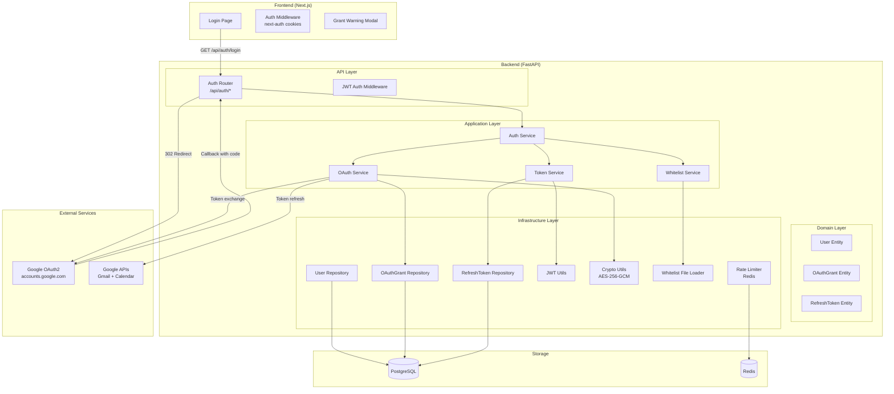
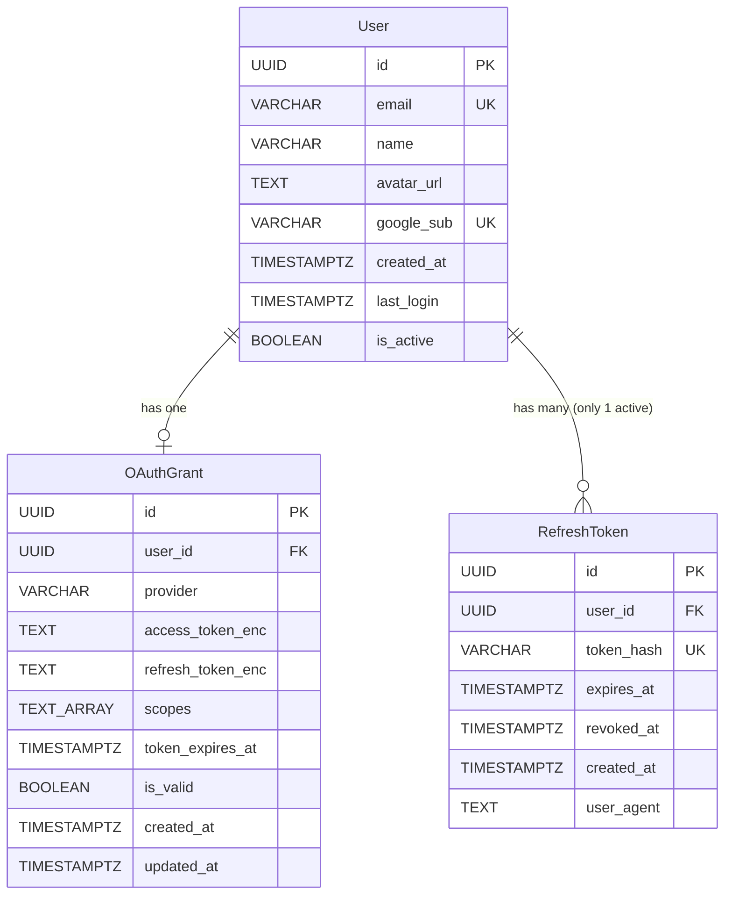

# Design Document: Identity & Auth

## Overview

The Identity & Auth module implements Google OAuth2 authentication for Vroom HR. It is the foundational module that all other modules depend on for user identity and API protection.

**Key Design Decisions:**
- Google OAuth2 as the sole authentication method (no email/password)
- JWT-based sessions with short-lived access tokens (15min) and longer refresh tokens (7d)
- Email whitelist for access control (plain text file, hot-reload)
- AES-256-GCM encryption for stored Google OAuth tokens
- Single active session per user (new login revokes old tokens)
- PKCE + CSRF state token for OAuth2 flow security

**Technology Choices:**
- Backend: FastAPI (Python 3.11+), SQLAlchemy 2.0 + SQLModel, Pydantic v2
- Auth libraries: python-jose (JWT), Authlib (OAuth2 client), cryptography (AES-256-GCM)
- Database: PostgreSQL 15+
- Cache: Redis 7+ (rate limiting)
- Frontend: Next.js 14+ (App Router), TypeScript

## Architecture



### Module Structure

```
backend/src/modules/identity/
├── domain/
│   ├── __init__.py
│   ├── entities.py          # User, OAuthGrant, RefreshToken
│   └── exceptions.py        # Domain-specific exceptions
├── application/
│   ├── __init__.py
│   ├── auth_service.py      # Orchestrates login/logout flow
│   ├── token_service.py     # JWT issue/refresh/revoke
│   ├── oauth_service.py     # Google OAuth2 token exchange/refresh
│   └── whitelist_service.py # Email whitelist check + hot-reload
├── infrastructure/
│   ├── __init__.py
│   ├── user_repository.py   # User CRUD
│   ├── oauth_grant_repository.py  # OAuthGrant CRUD
│   ├── refresh_token_repository.py # RefreshToken CRUD
│   ├── jwt_utils.py         # JWT encode/decode with python-jose
│   ├── crypto_utils.py      # AES-256-GCM encrypt/decrypt
│   ├── whitelist_loader.py  # File watcher + hot-reload
│   └── rate_limiter.py      # Redis-based rate limiting
└── api/
    ├── __init__.py
    ├── router.py             # FastAPI router for /api/auth/*
    ├── dependencies.py       # FastAPI dependencies (get_current_user)
    └── schemas.py            # Pydantic request/response schemas
```

## Components and Interfaces

### AuthService (Application Layer - Orchestrator)

```python
class AuthService:
    """Orchestrates the complete authentication flow."""

    async def initiate_login(self) -> LoginRedirect:
        """Generate OAuth2 redirect URL with state + PKCE."""
        ...

    async def handle_callback(self, code: str, state: str) -> AuthResult:
        """
        Process OAuth2 callback:
        1. Validate CSRF state
        2. Exchange code for Google tokens
        3. Validate email against whitelist
        4. Upsert user
        5. Store encrypted OAuth tokens
        6. Issue JWT session tokens
        """
        ...

    async def logout(self, refresh_token: str) -> None:
        """Revoke refresh token."""
        ...
```

### TokenService (Application Layer)

```python
class TokenService:
    """Manages JWT access and refresh tokens."""

    def create_access_token(self, user_id: UUID, email: str) -> str:
        """Issue JWT access token (15min expiry)."""
        ...

    def create_refresh_token(self, user_id: UUID) -> tuple[str, str]:
        """Issue refresh token, return (raw_token, token_hash)."""
        ...

    def verify_access_token(self, token: str) -> TokenPayload:
        """Validate and decode JWT access token."""
        ...

    async def refresh_access_token(self, refresh_token: str) -> str:
        """Validate refresh token and issue new access token."""
        ...

    async def revoke_user_tokens(self, user_id: UUID) -> None:
        """Revoke all active refresh tokens for a user."""
        ...
```

### OAuthService (Application Layer)

```python
class OAuthService:
    """Manages Google OAuth2 token operations."""

    async def exchange_code(self, code: str, code_verifier: str) -> GoogleTokens:
        """Exchange authorization code for Google tokens."""
        ...

    async def refresh_google_token(self, user_id: UUID) -> GoogleTokens | None:
        """Refresh expired Google access token. Returns None if revoked."""
        ...

    async def get_valid_access_token(self, user_id: UUID) -> str:
        """Get a valid Google access token, auto-refreshing if needed."""
        ...

    def determine_grant_status(self, scopes: list[str]) -> GrantStatus:
        """Check which scopes were granted (gmail, calendar)."""
        ...
```

### WhitelistService (Application Layer)

```python
class WhitelistService:
    """Email whitelist access control with hot-reload."""

    def is_allowed(self, email: str) -> bool:
        """Check if email is in whitelist (case-insensitive exact match)."""
        ...

    async def reload(self) -> None:
        """Reload whitelist from file."""
        ...
```

### CryptoUtils (Infrastructure Layer)

```python
class CryptoUtils:
    """AES-256-GCM encryption for OAuth tokens."""

    def encrypt(self, plaintext: str) -> str:
        """Encrypt plaintext, return base64-encoded ciphertext+nonce+tag."""
        ...

    def decrypt(self, ciphertext: str) -> str:
        """Decrypt base64-encoded ciphertext back to plaintext."""
        ...
```

### JWTUtils (Infrastructure Layer)

```python
class JWTUtils:
    """JWT token operations using python-jose."""

    def encode(self, payload: dict, expires_delta: timedelta) -> str:
        """Encode JWT with HS256."""
        ...

    def decode(self, token: str) -> dict:
        """Decode and validate JWT. Raises on invalid/expired."""
        ...

    def create_state_token(self, data: dict) -> str:
        """Create signed CSRF state token (10min expiry)."""
        ...

    def verify_state_token(self, token: str) -> dict:
        """Verify CSRF state token."""
        ...
```

### API Router Endpoints

```python
# GET /api/auth/login
async def login(request: Request) -> RedirectResponse:
    """Initiate Google OAuth2 login flow."""

# GET /api/auth/callback
async def callback(code: str, state: str, request: Request) -> RedirectResponse:
    """Handle Google OAuth2 callback."""

# POST /api/auth/refresh
async def refresh(request: Request) -> JSONResponse:
    """Refresh access token using refresh token cookie."""

# POST /api/auth/logout
async def logout(request: Request) -> JSONResponse:
    """Revoke refresh token and clear cookies."""

# GET /api/auth/me
async def me(current_user: User = Depends(get_current_user)) -> UserResponse:
    """Get current authenticated user profile."""

# GET /api/auth/grant-status
async def grant_status(current_user: User = Depends(get_current_user)) -> GrantStatusResponse:
    """Check Gmail/Calendar grant validity."""
```

### FastAPI Dependency: get_current_user

```python
async def get_current_user(request: Request) -> User:
    """
    Extract and validate JWT from access_token cookie.
    Returns User entity or raises HTTPException(401).
    """
    ...
```

## Data Models

### User Entity

```python
class User(SQLModel, table=True):
    __tablename__ = "users"

    id: UUID = Field(default_factory=uuid4, primary_key=True)
    email: str = Field(max_length=255, unique=True, nullable=False)
    name: str = Field(max_length=255, nullable=False)
    avatar_url: str | None = Field(default=None)
    google_sub: str = Field(max_length=255, unique=True, nullable=False)
    created_at: datetime = Field(default_factory=lambda: datetime.now(UTC), nullable=False)
    last_login: datetime = Field(default_factory=lambda: datetime.now(UTC), nullable=False)
    is_active: bool = Field(default=True, nullable=False)
```

### OAuthGrant Entity

```python
class OAuthGrant(SQLModel, table=True):
    __tablename__ = "oauth_grants"

    id: UUID = Field(default_factory=uuid4, primary_key=True)
    user_id: UUID = Field(foreign_key="users.id", nullable=False)
    provider: str = Field(default="google", max_length=50, nullable=False)
    access_token_enc: str = Field(nullable=False)
    refresh_token_enc: str = Field(nullable=False)
    scopes: list[str] = Field(sa_column=Column(ARRAY(String)), nullable=False)
    token_expires_at: datetime = Field(nullable=False)
    is_valid: bool = Field(default=True, nullable=False)
    created_at: datetime = Field(default_factory=lambda: datetime.now(UTC), nullable=False)
    updated_at: datetime = Field(default_factory=lambda: datetime.now(UTC), nullable=False)
```

### RefreshToken Entity

```python
class RefreshToken(SQLModel, table=True):
    __tablename__ = "refresh_tokens"

    id: UUID = Field(default_factory=uuid4, primary_key=True)
    user_id: UUID = Field(foreign_key="users.id", nullable=False)
    token_hash: str = Field(max_length=64, unique=True, nullable=False)
    expires_at: datetime = Field(nullable=False)
    revoked_at: datetime | None = Field(default=None)
    created_at: datetime = Field(default_factory=lambda: datetime.now(UTC), nullable=False)
    user_agent: str | None = Field(default=None)
```

### Pydantic Schemas

```python
class TokenPayload(BaseModel):
    """JWT access token payload."""
    sub: UUID          # user_id
    email: str
    exp: datetime
    iat: datetime

class GoogleTokens(BaseModel):
    """Tokens received from Google OAuth2."""
    access_token: str
    refresh_token: str | None
    id_token: str
    expires_in: int
    scope: str

class GoogleUserInfo(BaseModel):
    """User profile from Google ID token."""
    sub: str           # Google subject ID
    email: str
    name: str
    picture: str | None

class GrantStatus(BaseModel):
    """OAuth grant validity status."""
    gmail_grant_valid: bool
    calendar_grant_valid: bool

class UserResponse(BaseModel):
    """GET /api/auth/me response."""
    id: UUID
    email: str
    name: str
    avatar_url: str | None
    gmail_grant_valid: bool
    calendar_grant_valid: bool
    created_at: datetime
    last_login: datetime

class GrantStatusResponse(BaseModel):
    """GET /api/auth/grant-status response."""
    gmail_grant_valid: bool
    calendar_grant_valid: bool

class LoginRedirect(BaseModel):
    """Internal model for OAuth2 redirect data."""
    redirect_url: str
    state_token: str
    code_verifier: str
```

### Configuration (Pydantic Settings)

```python
class AuthSettings(BaseSettings):
    """Identity module configuration from environment."""

    google_client_id: str
    google_client_secret: str
    google_redirect_uri: str = "http://localhost:8000/api/auth/callback"

    jwt_secret_key: str
    jwt_algorithm: str = "HS256"
    access_token_expire_minutes: int = 15
    refresh_token_expire_days: int = 7

    oauth_token_encryption_key: str  # 32-byte key, base64-encoded
    whitelist_file_path: str = "config/whitelist.txt"

    rate_limit_login_max: int = 5
    rate_limit_login_window_seconds: int = 60

    frontend_url: str = "http://localhost:3000"

    class Config:
        env_prefix = "AUTH_"
```

### Database Relationships




## Correctness Properties

*A property is a characteristic or behavior that should hold true across all valid executions of a system — essentially, a formal statement about what the system should do. Properties serve as the bridge between human-readable specifications and machine-verifiable correctness guarantees.*

### Property 1: Encryption Round-Trip

*For any* arbitrary string (representing a Google OAuth token), encrypting it with AES-256-GCM and then decrypting the result SHALL produce the original string. Additionally, the encrypted form SHALL NOT equal the plaintext.

**Validates: Requirements 9.1, 9.2**

### Property 2: JWT Access Token Round-Trip

*For any* valid user_id (UUID) and email (string), creating a JWT access token and then verifying/decoding it SHALL return a payload containing the same user_id and email. The token SHALL have an expiry exactly 15 minutes from issuance.

**Validates: Requirements 5.1**

### Property 3: CSRF State Token Integrity

*For any* state data payload, creating a signed state token and then verifying it within the 10-minute window SHALL return the original payload. Verifying a tampered token (any single byte changed) SHALL raise a validation error.

**Validates: Requirements 1.2, 2.2**

### Property 4: Whitelist Case-Insensitive Matching

*For any* email string that exists in the whitelist, checking that email with any combination of upper/lower case characters SHALL return true. *For any* email string that does NOT exist in the whitelist, checking it SHALL return false regardless of case.

**Validates: Requirements 3.1**

### Property 5: Scope Determination Correctness

*For any* list of OAuth scopes, gmail_grant_valid SHALL be true if and only if the list contains all of (gmail.readonly, gmail.modify, gmail.send). calendar_grant_valid SHALL be true if and only if the list contains calendar.events.

**Validates: Requirements 11.1, 11.2**

### Property 6: Auth Middleware Rejects Invalid Tokens

*For any* request bearing a JWT that is malformed, expired, signed with a wrong key, or missing entirely, the auth middleware SHALL return HTTP 401 Unauthorized.

**Validates: Requirements 8.1, 8.2, 8.3**

### Property 7: User Upsert Idempotence

*For any* valid Google profile (email, name, avatar_url, google_sub), performing the upsert operation N times (N ≥ 1) SHALL result in exactly one User record in the database with that email. The last_login field SHALL reflect the most recent upsert time.

**Validates: Requirements 4.2, 4.3**

### Property 8: Single Active Session Invariant

*For any* user, after a successful login, there SHALL be exactly one non-revoked refresh token for that user in the database. All previously existing refresh tokens for that user SHALL have revoked_at set.

**Validates: Requirements 5.4**

## Error Handling

### Exception Hierarchy

```python
class AuthError(Exception):
    """Base exception for identity module."""
    status_code: int
    error_code: str
    message: str

class InvalidStateError(AuthError):
    """CSRF state token invalid or expired."""
    status_code = 400
    error_code = "AUTH_INVALID_STATE"
    message = "Invalid authentication state"

class GoogleAuthError(AuthError):
    """Google token exchange or API call failed."""
    status_code = 502
    error_code = "AUTH_GOOGLE_ERROR"
    message = "Failed to authenticate with Google"

class AccessDeniedError(AuthError):
    """Email not in whitelist."""
    status_code = 403
    error_code = "AUTH_ACCESS_DENIED"
    message = "Access denied. Contact administrator."

class InsufficientScopeError(AuthError):
    """User didn't grant all required scopes."""
    status_code = 400
    error_code = "AUTH_INSUFFICIENT_SCOPE"
    message = "Please grant all requested permissions"

class InvalidTokenError(AuthError):
    """JWT access or refresh token invalid."""
    status_code = 401
    error_code = "AUTH_INVALID_TOKEN"
    message = "Invalid or expired token"

class RateLimitExceededError(AuthError):
    """Too many login attempts."""
    status_code = 429
    error_code = "AUTH_RATE_LIMITED"
    message = "Too many login attempts. Please try again later."
```

### Error Response Format

All auth errors return a consistent JSON structure:

```json
{
  "error": {
    "code": "AUTH_INVALID_STATE",
    "message": "Invalid authentication state"
  }
}
```

### Error Handling Strategy

| Scenario | Action | User Impact |
|----------|--------|-------------|
| Invalid CSRF state | Return 400, log warning | User sees error, can retry login |
| Google API down | Return 502, log error | User sees retry button |
| Email not whitelisted | Return 403, log info | User sees "Access Denied" page |
| JWT expired | Return 401 | Frontend auto-refreshes via /api/auth/refresh |
| Refresh token expired | Return 401 | Frontend redirects to /login |
| Google token revoked | Mark grant invalid | User sees Grant Warning modal |
| Rate limit exceeded | Return 429 | User waits 60 seconds |
| Encryption key missing | Fail startup | App won't start (fail-fast) |
| Whitelist file missing | Fail startup | App won't start (fail-fast) |

## Testing Strategy

### Property-Based Tests (Hypothesis)

The project uses **Hypothesis** (Python) for property-based testing. Each property test runs a minimum of 100 iterations.

| Property | Target Function | Generator Strategy |
|----------|----------------|-------------------|
| Property 1: Encryption Round-Trip | `CryptoUtils.encrypt/decrypt` | `st.text()` for arbitrary strings |
| Property 2: JWT Round-Trip | `JWTUtils.encode/decode` | `st.uuids()` for user_id, `st.emails()` for email |
| Property 3: State Token Integrity | `JWTUtils.create_state_token/verify_state_token` | `st.dictionaries(st.text(), st.text())` for payload |
| Property 4: Whitelist Matching | `WhitelistService.is_allowed` | `st.emails()` + case mutation |
| Property 5: Scope Determination | `OAuthService.determine_grant_status` | `st.lists(st.sampled_from(ALL_SCOPES))` |
| Property 6: Middleware Rejection | `get_current_user` dependency | `st.text()` for malformed tokens + mutation strategies |
| Property 7: User Upsert Idempotence | `AuthService.handle_callback` (user upsert part) | `st.builds(GoogleUserInfo)` + `st.integers(min_value=1, max_value=5)` for repeat count |
| Property 8: Single Active Session | `TokenService.revoke_user_tokens` + `create_refresh_token` | `st.integers(min_value=1, max_value=10)` for existing token count |

**Configuration:**
- Library: `hypothesis` (Python)
- Min examples: 100 per property
- Tag format: `# Feature: identity-auth, Property N: {title}`

### Unit Tests (pytest)

| Component | Test Focus |
|-----------|------------|
| `CryptoUtils` | Encrypt/decrypt specific known values, wrong key fails |
| `JWTUtils` | Known token decode, expiry edge cases |
| `WhitelistService` | Empty whitelist, single entry, file not found |
| `TokenService` | Token creation with specific claims |
| `OAuthService` | Scope parsing for known scope combinations |
| `Auth Middleware` | Missing cookie, malformed header |

### Integration Tests (pytest + httpx + testcontainers)

| Flow | Test Scenario |
|------|---------------|
| Login flow | Mock Google, verify full callback → user created → cookies set |
| Whitelist rejection | Mock Google, non-whitelisted email → 403 |
| Token refresh | Login → wait → refresh → new access token |
| Logout | Login → logout → refresh fails with 401 |
| Grant status | Login with partial scopes → grant-status shows invalid |
| Rate limiting | 6 rapid requests → 6th returns 429 |
| Google token refresh | Mock expired Google token → auto-refresh on API call |
| Google token revoked | Mock revoked token → grant marked invalid |

### E2E Tests (Playwright)

| Test | Description |
|------|-------------|
| Login happy path | Click login → Google consent (mocked) → dashboard |
| Access denied | Non-whitelisted email → error page |
| Logout flow | Dashboard → logout → redirected to login |
| Session expiry | Wait for token expiry → auto-refresh → still on dashboard |
| Grant warning | Login without Gmail scope → warning modal appears |

### Test Infrastructure

- **Google OAuth mock**: `respx` library to intercept HTTP calls to Google endpoints
- **Database**: `testcontainers` with PostgreSQL for integration tests
- **Redis**: `testcontainers` with Redis for rate limiting tests
- **Fixtures**: Pre-generated Google ID tokens with known claims
- **No real Google calls in CI**: All external calls mocked
