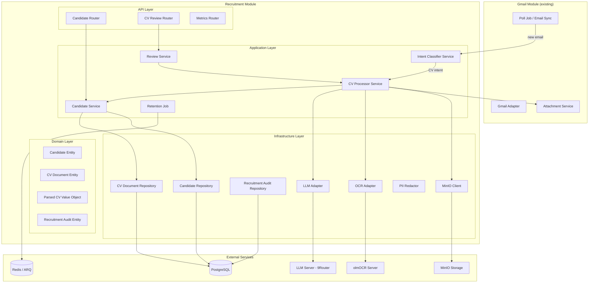
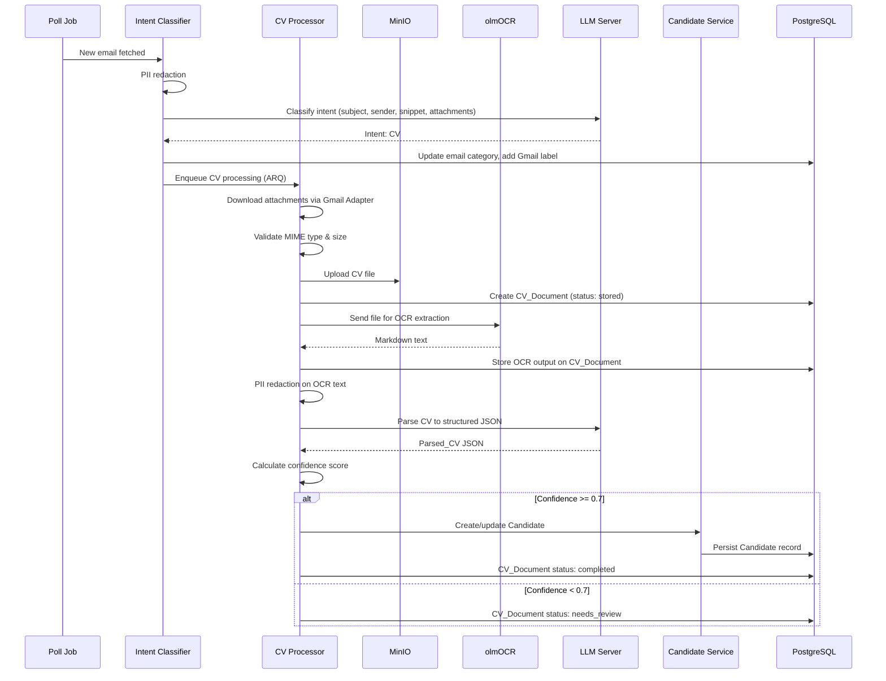
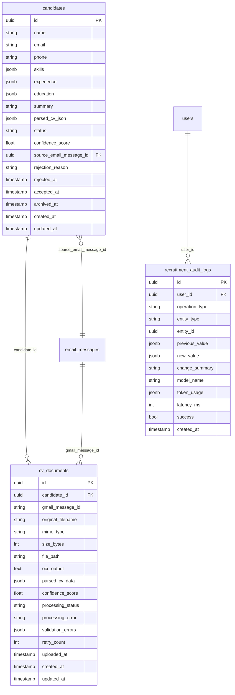
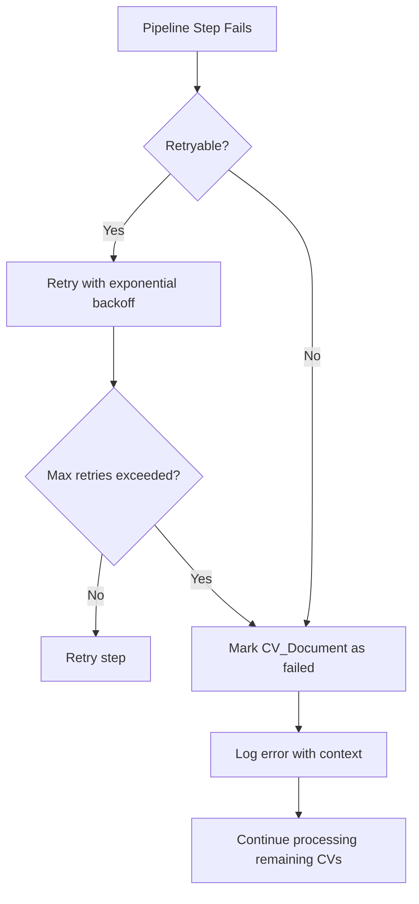

# Design Document — Recruitment CV Pipeline

## Overview

The Recruitment CV Pipeline module automates the end-to-end process of receiving CVs via email, extracting structured candidate data, and managing a candidate pool for HR decision-making. The module integrates with the existing Gmail module for email/attachment access and introduces AI-powered classification (LLM intent detection), OCR text extraction (olmOCR Vision Language Model), and LLM-based CV parsing.

**Key flows:**
1. **Email Classification** — Poll job triggers LLM-based intent classification on new emails; CV-intent emails enter the pipeline
2. **CV Processing Pipeline** — Download attachments → store in MinIO → OCR extraction → LLM parse → validate → create Candidate
3. **Candidate Pool Management** — CRUD + actions (view CV, schedule interview, send email, reject, accept, archive)
4. **Manual Review** — HR reviews/corrects failed or low-confidence CV parses
5. **Data Retention** — Scheduled cleanup of rejected candidates per Vietnamese data protection regulations

**Cross-module communication:**
- Gmail module → Recruitment module: via application service interface (AttachmentService, GmailAdapter for labels/send)
- Recruitment module → Interview module: via domain event `candidate_accepted` / `interview_scheduled`
- No direct imports between modules

## Architecture



**Processing Pipeline Sequence:**



## Components and Interfaces

### Application Services

#### IntentClassifierService
```python
class IntentClassifierService:
    """Classifies emails by intent using LLM with PII redaction."""

    async def classify_email(self, email_message_id: UUID) -> EmailIntent:
        """Classify a single email. Returns intent enum value."""

    async def process_classification_result(
        self, email_message_id: UUID, intent: EmailIntent
    ) -> None:
        """Apply label and enqueue CV processing if intent is CV."""
```

#### CVProcessorService
```python
class CVProcessorService:
    """Orchestrates the full CV processing pipeline."""

    async def process_cv_from_email(self, email_message_id: UUID) -> None:
        """Full pipeline: download → store → OCR → parse → candidate."""

    async def process_single_attachment(
        self, email_message_id: UUID, attachment_data: FetchedAttachment
    ) -> CVDocument:
        """Process one attachment through the pipeline."""

    async def retry_llm_parse(self, cv_document_id: UUID) -> ParsedCV | None:
        """Re-run LLM parse for manual review retry."""
```

#### CandidateService
```python
class CandidateService:
    """Manages Candidate CRUD and status transitions."""

    async def create_or_update_candidate(
        self, parsed_cv: ParsedCV, cv_document_id: UUID, source_email_id: UUID
    ) -> Candidate:
        """Create new or update existing candidate by email match."""

    async def list_candidates(self, filters: CandidateFilters) -> PaginatedResult[Candidate]:
        """Paginated list with search and filters."""

    async def get_candidate(self, candidate_id: UUID) -> CandidateDetail:
        """Full candidate detail with CV documents."""

    async def reject_candidate(self, candidate_id: UUID, reason: str | None) -> Candidate:
        """Transition to rejected status."""

    async def accept_candidate(self, candidate_id: UUID) -> Candidate:
        """Transition to accepted status, emit domain event."""

    async def archive_candidate(self, candidate_id: UUID) -> Candidate:
        """Transition to archived status."""

    async def schedule_interview(
        self, candidate_id: UUID, request: ScheduleInterviewRequest
    ) -> Candidate:
        """Transition to interview_scheduled, emit domain event."""

    async def send_email_to_candidate(
        self, candidate_id: UUID, request: SendEmailRequest
    ) -> None:
        """Send email via Gmail adapter."""
```

#### ReviewService
```python
class ReviewService:
    """Manages the CV manual review queue."""

    async def list_review_queue(self, pagination: PaginationParams) -> PaginatedResult[CVReviewItem]:
        """List CV documents needing review."""

    async def submit_correction(
        self, cv_document_id: UUID, corrected_data: ParsedCVInput
    ) -> Candidate:
        """Apply HR corrections and create/update candidate."""

    async def retry_parse(self, cv_document_id: UUID) -> CVDocument:
        """Re-run LLM parse on stored OCR text."""

    async def dismiss(self, cv_document_id: UUID) -> None:
        """Dismiss a CV from review queue."""
```

### Infrastructure Adapters

#### OCRAdapter
```python
class OCRAdapter:
    """Communicates with olmOCR server for text extraction."""

    async def extract_text(self, file_data: bytes, mime_type: str, filename: str) -> str:
        """Send file to olmOCR, return markdown text. Handles PDF chunking."""
```

#### LLMAdapter
```python
class LLMAdapter:
    """Communicates with LLM via OpenAI-compatible API."""

    async def classify_intent(self, prompt: str) -> EmailIntent:
        """Classify email intent. Returns parsed intent enum."""

    async def parse_cv(self, ocr_text: str) -> ParsedCVResult:
        """Parse OCR text into structured CV data. Returns JSON + raw response."""
```

#### PIIRedactor
```python
class PIIRedactor:
    """Redacts PII from text before sending to LLM."""

    def redact(self, text: str) -> str:
        """Replace CCCD, MST, bank accounts, salary figures with [REDACTED]."""
```

#### RecruitmentMinIOClient
```python
class RecruitmentMinIOClient:
    """MinIO operations for CV storage. Follows employee module pattern."""

    async def upload_cv(self, path: str, file_data: bytes, content_type: str) -> str:
        """Upload CV file to MinIO."""

    async def download_cv(self, path: str) -> bytes:
        """Download CV file from MinIO."""

    async def delete_cv(self, path: str) -> None:
        """Delete CV file from MinIO."""

    async def generate_presigned_url(self, path: str, expires_seconds: int = 900) -> str:
        """Generate pre-signed download URL (15 min default)."""
```

### API Schemas (Pydantic v2)

```python
# Request schemas
class CandidateListParams(BaseModel):
    page: int = Field(default=1, ge=1)
    page_size: int = Field(default=20, ge=1, le=100)
    search: str | None = Field(default=None, min_length=1, max_length=200)
    status: list[CandidateStatus] | None = None
    from_date: date | None = None
    to_date: date | None = None
    min_confidence: float | None = Field(default=None, ge=0.0, le=1.0)
    skills: str | None = None  # comma-separated

class ScheduleInterviewRequest(BaseModel):
    date: date  # must be future
    time: time
    duration_minutes: int = Field(ge=15, le=180)
    interviewer_ids: list[UUID] = Field(min_length=1, max_length=10)
    notes: str | None = Field(default=None, max_length=1000)

class SendEmailRequest(BaseModel):
    subject: str = Field(min_length=1, max_length=500)
    body_html: str = Field(max_length=100_000)
    template_name: str | None = Field(default=None, max_length=100)

class RejectRequest(BaseModel):
    reason: str | None = Field(default=None, max_length=1000)

class ParsedCVInput(BaseModel):
    name: str = Field(min_length=1, max_length=200)
    email: EmailStr = Field(max_length=254)
    phone: str = Field(default="", max_length=20)
    skills: list[str] = Field(default_factory=list, max_length=50)
    experience: list[ExperienceItem] = Field(default_factory=list, max_length=20)
    education: list[EducationItem] = Field(default_factory=list, max_length=10)
    summary: str = Field(default="", max_length=500)
```

## Data Models

### Entity: Candidate

```python
class Candidate(SQLModel, table=True):
    __tablename__ = "candidates"

    id: UUID = Field(default_factory=uuid4, primary_key=True)
    name: str = Field(max_length=255, nullable=False)
    email: str = Field(max_length=255, nullable=False, index=True)
    phone: str = Field(default="", max_length=20)
    skills: list[str] = Field(default_factory=list, sa_column=Column(JSONB, nullable=False))
    experience: list[dict] = Field(default_factory=list, sa_column=Column(JSONB, nullable=False))
    education: list[dict] = Field(default_factory=list, sa_column=Column(JSONB, nullable=False))
    summary: str = Field(default="", max_length=500)
    parsed_cv_json: dict | None = Field(default=None, sa_column=Column(JSONB))
    status: str = Field(default="new", max_length=30, nullable=False, index=True)
    confidence_score: float = Field(default=0.0, nullable=False)
    source_email_message_id: UUID | None = Field(default=None, foreign_key="email_messages.id")
    rejection_reason: str | None = Field(default=None, max_length=1000)
    rejected_at: datetime | None = Field(default=None, sa_column=Column(DateTime(timezone=True)))
    accepted_at: datetime | None = Field(default=None, sa_column=Column(DateTime(timezone=True)))
    archived_at: datetime | None = Field(default=None, sa_column=Column(DateTime(timezone=True)))
    created_at: datetime = Field(
        default_factory=lambda: datetime.now(UTC),
        sa_column=Column(DateTime(timezone=True), nullable=False),
    )
    updated_at: datetime = Field(
        default_factory=lambda: datetime.now(UTC),
        sa_column=Column(DateTime(timezone=True), nullable=False),
    )
```

### Entity: CVDocument

```python
class CVDocument(SQLModel, table=True):
    __tablename__ = "cv_documents"

    id: UUID = Field(default_factory=uuid4, primary_key=True)
    candidate_id: UUID | None = Field(default=None, foreign_key="candidates.id", index=True)
    gmail_message_id: str = Field(max_length=255, nullable=False, index=True)
    original_filename: str = Field(max_length=255, nullable=False)
    mime_type: str = Field(max_length=100, nullable=False)
    size_bytes: int = Field(nullable=False)
    file_path: str = Field(max_length=500, nullable=False)
    ocr_output: str | None = Field(default=None)
    parsed_cv_data: dict | None = Field(default=None, sa_column=Column(JSONB))
    confidence_score: float | None = Field(default=None)
    processing_status: str = Field(default="pending", max_length=30, nullable=False, index=True)
    processing_error: str | None = Field(default=None, max_length=500)
    validation_errors: list[dict] | None = Field(default=None, sa_column=Column(JSONB))
    retry_count: int = Field(default=0, nullable=False)
    uploaded_at: datetime = Field(
        default_factory=lambda: datetime.now(UTC),
        sa_column=Column(DateTime(timezone=True), nullable=False),
    )
    created_at: datetime = Field(
        default_factory=lambda: datetime.now(UTC),
        sa_column=Column(DateTime(timezone=True), nullable=False),
    )
    updated_at: datetime = Field(
        default_factory=lambda: datetime.now(UTC),
        sa_column=Column(DateTime(timezone=True), nullable=False),
    )
```

### Entity: RecruitmentAuditLog

```python
class RecruitmentAuditLog(SQLModel, table=True):
    __tablename__ = "recruitment_audit_logs"

    id: UUID = Field(default_factory=uuid4, primary_key=True)
    user_id: UUID | None = Field(default=None, foreign_key="users.id", index=True)
    operation_type: str = Field(max_length=50, nullable=False, index=True)
    entity_type: str = Field(max_length=50, nullable=False)
    entity_id: UUID | None = Field(default=None, index=True)
    previous_value: dict | None = Field(default=None, sa_column=Column(JSONB))
    new_value: dict | None = Field(default=None, sa_column=Column(JSONB))
    change_summary: str | None = Field(default=None, max_length=500)
    model_name: str | None = Field(default=None, max_length=100)
    token_usage: dict | None = Field(default=None, sa_column=Column(JSONB))
    latency_ms: int | None = Field(default=None)
    success: bool = Field(default=True, nullable=False)
    created_at: datetime = Field(
        default_factory=lambda: datetime.now(UTC),
        sa_column=Column(DateTime(timezone=True), nullable=False, index=True),
    )
```

### Value Object: ParsedCV

```python
class ExperienceItem(BaseModel):
    company: str = Field(max_length=200)
    title: str = Field(max_length=200)
    duration: str = Field(default="", max_length=100)
    description: str = Field(default="", max_length=1000)

class EducationItem(BaseModel):
    institution: str = Field(max_length=200)
    degree: str = Field(default="", max_length=100)
    field: str = Field(default="", max_length=200)
    year: str = Field(default="", max_length=20)

class ParsedCV(BaseModel):
    name: str = Field(max_length=200)
    email: str = Field(max_length=254)
    phone: str = Field(default="", max_length=20)
    skills: list[str] = Field(default_factory=list, max_length=50)
    experience: list[ExperienceItem] = Field(default_factory=list, max_length=20)
    education: list[EducationItem] = Field(default_factory=list, max_length=10)
    summary: str = Field(default="", max_length=500)
```

### Enum: CandidateStatus

```python
class CandidateStatus(str, Enum):
    NEW = "new"
    REVIEWING = "reviewing"
    INTERVIEW_SCHEDULED = "interview_scheduled"
    ACCEPTED = "accepted"
    REJECTED = "rejected"
    ARCHIVED = "archived"
```

### Enum: ProcessingStatus

```python
class ProcessingStatus(str, Enum):
    PENDING = "pending"
    OCR_PROCESSING = "ocr_processing"
    LLM_PARSING = "llm_parsing"
    COMPLETED = "completed"
    NEEDS_REVIEW = "needs_review"
    FAILED = "failed"
    SKIPPED = "skipped"
    DISMISSED = "dismissed"
    UPLOAD_FAILED = "upload_failed"
    PERMANENTLY_FAILED = "permanently_failed"
```

### Enum: EmailIntent

```python
class EmailIntent(str, Enum):
    CV = "cv"
    PARTNER = "partner"
    EVENT = "event"
    INTERNAL = "internal"
    OTHER = "other"
```

### Configuration: RecruitmentSettings

```python
class RecruitmentSettings(BaseSettings):
    model_config = SettingsConfigDict(env_prefix="RECRUITMENT_")

    # LLM
    llm_base_url: str = "http://127.0.0.1:20128/v1"
    llm_model: str = "NullNyx-Combo"
    llm_timeout_seconds: int = 30
    llm_max_retries: int = 3

    # olmOCR
    olmocr_api_url: str = "https://olmocr.aibuddy.vn/ocr"
    olmocr_timeout_seconds: int = 600
    olmocr_max_retries: int = 3
    olmocr_max_pages_per_chunk: int = 20

    # MinIO
    minio_endpoint: str = "localhost:9000"
    minio_access_key: str = "minioadmin"
    minio_secret_key: str = "minioadmin"
    minio_bucket: str = "recruitment-cv"

    # Processing
    max_file_size_bytes: int = 10 * 1024 * 1024  # 10MB
    max_attachments_per_email: int = 20
    max_concurrent_cv_tasks: int = 3
    pipeline_timeout_seconds: int = 660  # 11 minutes
    confidence_threshold: float = 0.7

    # Data retention
    candidate_retention_days: int = Field(default=90, ge=30, le=365)
    retention_job_cron: str = "0 2 * * *"  # daily at 02:00 UTC
    retention_batch_size: int = 500

    # Presigned URL
    presigned_url_expiry_seconds: int = 900  # 15 minutes
```

### Database Relationships




## Correctness Properties

*A property is a characteristic or behavior that should hold true across all valid executions of a system — essentially, a formal statement about what the system should do. Properties serve as the bridge between human-readable specifications and machine-verifiable correctness guarantees.*

### Property 1: Intent classification prompt includes all required email metadata

*For any* EmailMessage with subject, sender_email, sender_name, snippet, and attachment metadata (filenames, MIME types, count), the classification prompt constructed by IntentClassifierService SHALL contain all of these fields as substrings.

**Validates: Requirements 1.2, 1.3**

### Property 2: PII redaction replaces all sensitive patterns while preserving surrounding text

*For any* text string containing CCCD/CMND numbers (12 consecutive digits), MST (10-13 consecutive digits), bank account numbers (8-19 consecutive digits), or salary figures (numbers adjacent to "VND", "đ", "triệu", "tr", or comma-formatted numbers ≥ 1,000,000), the PII_Redactor SHALL replace each occurrence with "[REDACTED]" and the non-PII portions of the text SHALL remain unchanged.

**Validates: Requirements 1.6, 4.2**

### Property 3: Attachment validation accepts only allowed MIME types within size limit

*For any* attachment with a MIME type and size_bytes, the validation function SHALL return true if and only if the MIME type is one of {application/pdf, application/vnd.openxmlformats-officedocument.wordprocessingml.document, image/jpeg, image/png} AND size_bytes ≤ 10,485,760 (10MB).

**Validates: Requirements 2.2, 2.3**

### Property 4: Confidence score calculation is deterministic and bounded

*For any* ParsedCV object, the calculated confidence_score SHALL equal the sum of: 0.25 if name is non-empty + 0.25 if email is non-empty + 0.1 if phone is non-empty + 0.1 if skills is non-empty + 0.15 if experience is non-empty + 0.1 if education is non-empty + 0.05 if summary is non-empty, and the result SHALL always be in the range [0.0, 1.0].

**Validates: Requirements 4.3**

### Property 5: Confidence threshold determines automatic vs manual processing

*For any* ParsedCV with a calculated confidence_score, IF confidence_score ≥ 0.7 THEN the system SHALL proceed to candidate creation (not flag for review), and IF confidence_score < 0.7 THEN the system SHALL set Processing_Status to "needs_review" without creating a Candidate record.

**Validates: Requirements 4.4, 4.5, 5.8**

### Property 6: Candidate field validation enforces name and email constraints

*For any* ParsedCV, validation SHALL pass if and only if name is a non-empty string with length ≤ 255 characters AND email contains exactly one "@" character with non-empty local part and non-empty domain part and total length ≤ 255 characters. When validation fails, the system SHALL set Processing_Status to "needs_review" with validation_errors indicating which fields failed.

**Validates: Requirements 5.1, 5.6**

### Property 7: Candidate deduplication by email preserves existing status

*For any* two ParsedCVs with identical email addresses processed sequentially, after both are processed there SHALL exist exactly one Candidate record with that email, the Candidate's data fields (name, phone, skills, experience, education, summary) SHALL reflect the second ParsedCV's values, and the Candidate's status SHALL remain unchanged from before the second processing.

**Validates: Requirements 5.5**

### Property 8: Candidate status transitions follow the valid state machine

*For any* Candidate with a given status, the following transitions SHALL be the only valid ones:
- "new" → "reviewing", "interview_scheduled", "rejected", "archived"
- "reviewing" → "interview_scheduled", "accepted", "rejected", "archived"
- "interview_scheduled" → "accepted", "rejected", "archived"
- "accepted" → (no transitions except system-level)
- "rejected" → (no transitions)
- "archived" → (no transitions except re-archive idempotently)

Any attempt to perform an invalid transition SHALL result in an error with code INVALID_STATUS_TRANSITION.

**Validates: Requirements 9.2, 9.3, 11.1, 11.3, 12.1, 12.3, 13.1, 13.6**

### Property 9: Search and filter results are correct subsets

*For any* candidate list query with search term and/or filters (status, date range, min_confidence, skills), every returned Candidate SHALL satisfy ALL active filter conditions simultaneously: (a) if search is provided, at least one of name/email/phone/skills contains the search substring case-insensitively, (b) if status filter is provided, candidate status is in the filter set, (c) if date range is provided, created_at is within [from_date, to_date] inclusive, (d) if min_confidence is provided, confidence_score ≥ min_confidence, (e) if skills filter is provided, at least one candidate skill matches one filter skill case-insensitively.

**Validates: Requirements 6.3, 6.4, 6.5**

### Property 10: Pagination invariants hold for candidate list queries

*For any* candidate list query, the total_count SHALL equal the total number of candidates matching the query (independent of page/page_size), the returned page SHALL contain at most page_size items, and items SHALL be sorted by created_at descending.

**Validates: Requirements 6.1, 6.6**

### Property 11: Archive action is idempotent

*For any* Candidate already in "archived" status, calling the archive action SHALL return HTTP 200 with the existing Candidate record and SHALL NOT modify the archived_at timestamp.

**Validates: Requirements 13.3**

### Property 12: Retention job selects only eligible candidates for deletion

*For any* set of Candidate records, the retention job SHALL select for deletion only those where status = "rejected" AND rejected_at is older than CANDIDATE_RETENTION_DAYS from the current time. Candidates with status "new", "reviewing", "interview_scheduled", "accepted", or "archived" SHALL never be selected regardless of age.

**Validates: Requirements 15.1, 15.6**

### Property 13: Audit logs never contain PII data

*For any* RecruitmentAuditLog entry, the serialized content (change_summary, previous_value, new_value) SHALL NOT contain CCCD/CMND numbers (12 consecutive digits), MST (10-13 digits), bank account numbers (8-19 digits), salary figures, home addresses, or personal phone numbers.

**Validates: Requirements 17.3**

### Property 14: Filename sanitization produces valid storage paths

*For any* input filename string, the sanitized output SHALL: (a) contain no path separator characters (/, \\), (b) contain no special characters that are invalid for object storage keys, (c) have length ≤ 255 characters, and (d) if two attachments in the same email produce identical sanitized names, they SHALL be disambiguated with numeric suffixes (_1, _2, etc.).

**Validates: Requirements 2.4**

## Error Handling

### Error Categories and HTTP Status Codes

| Category | HTTP Status | Error Code | Description |
|----------|-------------|------------|-------------|
| Not Found | 404 | CANDIDATE_NOT_FOUND | Candidate ID doesn't exist |
| Not Found | 404 | CV_DOCUMENT_NOT_FOUND | CV document doesn't exist or doesn't belong to candidate |
| Not Found | 404 | CV_FILE_MISSING | File exists in DB but not in MinIO |
| Validation | 400 | INVALID_CANDIDATE_ID | Path parameter is not valid UUID |
| Validation | 400 | INVALID_CANDIDATE_EMAIL | Candidate email is empty or invalid |
| Validation | 400 | TEMPLATE_NOT_FOUND | Email template doesn't exist |
| Validation | 422 | VALIDATION_ERROR | Request body fails validation |
| Validation | 422 | INVALID_INTERVIEWER | Interviewer ID doesn't match employee |
| Auth | 401 | UNAUTHORIZED | No valid session |
| Conflict | 409 | INVALID_STATUS_TRANSITION | Status transition not allowed |
| Conflict | 409 | GMAIL_NOT_CONNECTED | Gmail OAuth not connected |
| External | 502 | STORAGE_SERVICE_UNAVAILABLE | MinIO unreachable |
| External | 502 | EMAIL_SEND_FAILED | Gmail send failed |

### Pipeline Error Handling Strategy



**Retry policies:**
- LLM calls (intent/parse): 3 retries, backoff 1s/2s/4s, per-call timeout 15s (intent) / 30s (parse)
- olmOCR: 3 retries, backoff 5s/10s/20s, per-call timeout 600s
- MinIO upload: 3 retries, backoff 1s/2s/4s
- Overall pipeline timeout: 660s (11 minutes)

**Graceful degradation:**
- If PII redaction fails → skip classification, mark `classification_failed`
- If OCR produces < 50 chars → mark `ocr_insufficient_text`, flag for review
- If LLM returns invalid JSON → retry once with simplified prompt, then mark `llm_parse_error`
- If confidence < 0.7 → don't create candidate, flag for HR review
- If audit logging fails → proceed with operation, log error separately

### Domain Exceptions

```python
class RecruitmentError(Exception):
    """Base exception for recruitment module."""

class CandidateNotFoundError(RecruitmentError):
    """Candidate with given ID does not exist."""

class CVDocumentNotFoundError(RecruitmentError):
    """CV document not found or doesn't belong to candidate."""

class InvalidStatusTransitionError(RecruitmentError):
    """Attempted status transition is not allowed."""
    def __init__(self, current_status: str, attempted_action: str): ...

class CVFileNotFoundError(RecruitmentError):
    """File exists in DB but missing from MinIO storage."""

class StorageServiceUnavailableError(RecruitmentError):
    """MinIO service is unreachable."""

class GmailNotConnectedError(RecruitmentError):
    """Gmail OAuth connection is not active."""

class PipelineTimeoutError(RecruitmentError):
    """CV processing pipeline exceeded maximum time."""

class OCRExtractionError(RecruitmentError):
    """OCR text extraction failed."""

class LLMParseError(RecruitmentError):
    """LLM failed to parse CV into structured data."""
```

## Testing Strategy

### Property-Based Testing (Hypothesis)

The project already includes `hypothesis>=6.100.0` in dev dependencies. Property-based tests will use Hypothesis to generate random inputs and verify the correctness properties defined above.

**Configuration:**
- Minimum 100 examples per property test (`@settings(max_examples=100)`)
- Each test tagged with: `# Feature: recruitment-cv-pipeline, Property {N}: {title}`
- Test file: `backend/tests/recruitment/test_properties.py`

**Properties to implement as PBT:**

| Property | Module Under Test | Generator Strategy |
|----------|-------------------|-------------------|
| P1: Prompt construction | IntentClassifierService | Random EmailMessage metadata |
| P2: PII redaction | PIIRedactor | Random text with embedded PII patterns |
| P3: Attachment validation | Validation function | Random MIME types + file sizes |
| P4: Confidence calculation | Confidence calculator | Random ParsedCV with optional fields |
| P5: Confidence threshold | CVProcessorService | Random ParsedCV objects |
| P6: Candidate validation | Validation function | Random name/email strings |
| P7: Deduplication | CandidateService | Pairs of ParsedCV with same email |
| P8: Status transitions | CandidateService | Random (status, action) pairs |
| P9: Search/filter | CandidateRepository | Random candidates + query params |
| P10: Pagination | CandidateRepository | Random candidate lists + page params |
| P11: Archive idempotence | CandidateService | Already-archived candidates |
| P12: Retention selection | RetentionJob | Random candidates with various statuses/dates |
| P13: Audit PII exclusion | AuditLogger | Random audit entries |
| P14: Filename sanitization | Sanitize function | Random filenames with special chars |

### Unit Tests (pytest)

Focus on specific examples and edge cases:
- LLM response parsing (valid JSON, invalid JSON, timeout)
- PDF chunking logic (exact boundary at 20 pages)
- DOCX text extraction fallback logic
- Email template rendering with missing placeholders
- Status transition error messages
- Pagination edge cases (empty results, last page)
- Date range filter boundary conditions

### Integration Tests (pytest + testcontainers)

- Full pipeline flow with mocked external services (olmOCR, LLM)
- Database operations (CRUD, upsert, cascade delete)
- MinIO upload/download/presigned URL generation
- ARQ job enqueue and execution
- Gmail adapter interaction (label management, send)
- Retention job execution with real DB

### Test Organization

```
backend/tests/recruitment/
├── test_properties.py          # Property-based tests (14 properties)
├── test_pii_redactor.py        # Unit tests for PII redaction edge cases
├── test_confidence_score.py    # Unit tests for score calculation
├── test_status_transitions.py  # Unit tests for state machine
├── test_filename_sanitizer.py  # Unit tests for sanitization
├── test_candidate_service.py   # Integration tests
├── test_cv_processor.py        # Integration tests with mocked OCR/LLM
├── test_intent_classifier.py   # Integration tests with mocked LLM
├── test_review_service.py      # Integration tests
├── test_retention_job.py       # Integration tests
├── test_api_candidates.py      # API endpoint tests
├── test_api_cv_review.py       # API endpoint tests
└── conftest.py                 # Shared fixtures, factories
```
