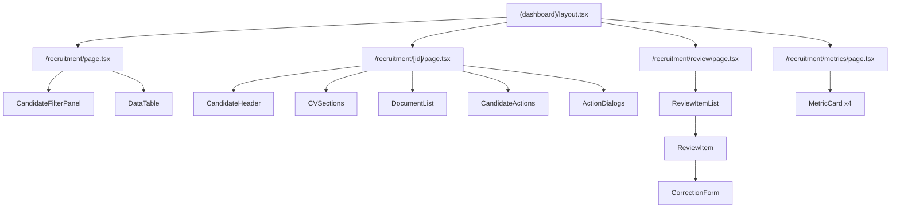
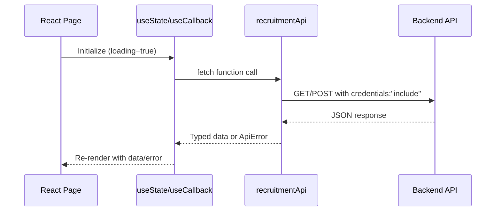

# Design Document: Recruitment UI

## Overview

The Recruitment UI adds a complete frontend interface for the automated CV recruitment pipeline to the existing Vroom HR dashboard. It consists of four pages — Candidate List, Candidate Detail, CV Review Queue, and Metrics Dashboard — integrated into the existing App Router layout with sidebar navigation, breadcrumbs, and command bar support.

The design follows established project patterns: `DataTable<T>` for paginated lists, `StatCard` for metrics, shadcn/ui primitives for forms and dialogs, and the existing API client pattern (`handleResponse<T>`, `ApiError` class) for backend communication.

## Architecture

### Component Tree



### Data Flow



All pages use a fetch-on-mount pattern with `useEffect` + `useCallback`, matching the existing `EmployeesPage` pattern. No external state management library is needed — React's `useState` handles local page state, and data is re-fetched on filter/pagination changes.

## Components and Interfaces

### File/Folder Structure

```
frontend/src/
├── app/(dashboard)/recruitment/
│   ├── page.tsx                          # Candidate list page
│   ├── [id]/
│   │   └── page.tsx                      # Candidate detail page
│   ├── review/
│   │   └── page.tsx                      # CV review queue page
│   └── metrics/
│       └── page.tsx                      # Metrics dashboard page
├── components/recruitment/
│   ├── candidate-filter-panel.tsx        # Search + filters toolbar
│   ├── candidate-actions.tsx             # Action buttons + state machine logic
│   ├── candidate-status-badge.tsx        # Colored status badge
│   ├── confidence-score.tsx              # Score display with progress bar
│   ├── cv-sections.tsx                   # Parsed CV data sections
│   ├── document-list.tsx                 # CV document list with view buttons
│   ├── review-item.tsx                   # Single review queue item
│   ├── correction-form.tsx              # Editable CV correction form
│   ├── reject-dialog.tsx                 # Rejection reason dialog
│   ├── accept-dialog.tsx                 # Accept confirmation dialog
│   ├── archive-dialog.tsx                # Archive confirmation dialog
│   ├── schedule-interview-dialog.tsx     # Interview scheduling dialog
│   ├── send-email-dialog.tsx             # Email composition dialog
│   └── metric-card.tsx                   # Enhanced stat card with color coding
├── lib/api/
│   └── recruitment.ts                    # Recruitment API client module
└── lib/
    └── recruitment-utils.ts              # Status colors, transitions, formatters
```

### Key Component Responsibilities

| Component | Responsibility |
|-----------|---------------|
| `CandidateFilterPanel` | Renders search input, status select, date range picker, confidence slider, skills input, clear button. Emits filter change callbacks. |
| `CandidateActions` | Reads candidate status, renders valid action buttons, manages dialog open state. |
| `CandidateStatusBadge` | Maps status enum to Vietnamese label + color variant. |
| `ConfidenceScore` | Renders percentage text + colored progress bar with aria-label. |
| `CVSections` | Renders summary, skills badges, experience timeline, education list. |
| `DocumentList` | Lists CV documents with filename, date, status, and "Xem CV" button. |
| `ReviewItem` | Expandable item showing parsed data + correction form + action buttons. |
| `CorrectionForm` | react-hook-form + zod validated form for ParsedCVInput fields. |
| `MetricCard` | Extended StatCard with conditional color coding based on thresholds. |

## Data Models

### TypeScript Interfaces (src/lib/api/recruitment.ts)

```typescript
// --- Enums ---

export type CandidateStatus =
  | "new"
  | "reviewing"
  | "interview_scheduled"
  | "accepted"
  | "rejected"
  | "archived";

export type ProcessingStatus =
  | "pending"
  | "ocr_processing"
  | "llm_parsing"
  | "completed"
  | "needs_review"
  | "failed"
  | "skipped"
  | "dismissed"
  | "upload_failed"
  | "permanently_failed";

// --- Candidate Types ---

export interface CandidateListItem {
  id: string;
  name: string;
  email: string;
  phone: string;
  skills: string[];
  status: CandidateStatus;
  confidence_score: number;
  created_at: string; // ISO datetime
  has_cv: boolean;
}

export interface CandidateListResponse {
  candidates: CandidateListItem[];
  total_count: number;
  page: number;
  page_size: number;
}

export interface ExperienceItem {
  company: string;
  role: string;
  duration: string;
}

export interface EducationItem {
  institution: string;
  degree: string;
  year: string;
}

export interface CVDocument {
  id: string;
  original_filename: string;
  mime_type: string;
  size_bytes: number;
  uploaded_at: string;
  presigned_url: string | null;
  processing_status: ProcessingStatus;
}

export interface CandidateDetail {
  id: string;
  name: string;
  email: string;
  phone: string;
  skills: string[];
  experience: ExperienceItem[];
  education: EducationItem[];
  summary: string;
  status: CandidateStatus;
  confidence_score: number;
  source_email_message_id: string | null;
  rejection_reason: string | null;
  rejected_at: string | null;
  accepted_at: string | null;
  archived_at: string | null;
  created_at: string;
  updated_at: string;
  cv_documents: CVDocument[];
}

// --- CV Review Types ---

export interface CVReviewItem {
  id: string;
  candidate_id: string | null;
  gmail_message_id: string;
  original_filename: string;
  mime_type: string;
  size_bytes: number;
  ocr_output: string | null;
  parsed_cv_data: ParsedCVData | null;
  confidence_score: number | null;
  processing_status: ProcessingStatus;
  processing_error: string | null;
  validation_errors: ValidationError[] | null;
  retry_count: number;
  uploaded_at: string;
  created_at: string;
}

export interface ParsedCVData {
  name?: string;
  email?: string;
  phone?: string;
  skills?: string[];
  experience?: ExperienceItem[];
  education?: EducationItem[];
  summary?: string;
}

export interface ValidationError {
  field: string;
  message: string;
}

export interface CVReviewListResponse {
  items: CVReviewItem[];
  total: number;
  page: number;
  page_size: number;
}

// --- Metrics Types ---

export interface MetricsResponse {
  average_processing_time_ms: number;
  success_rate: number;   // 0.0–1.0
  failure_rate: number;   // 0.0–1.0
  queue_depth: number;
}

// --- Request Types ---

export interface CandidateListParams {
  page?: number;
  page_size?: number;
  search?: string;
  status?: CandidateStatus[];
  from_date?: string;  // YYYY-MM-DD
  to_date?: string;    // YYYY-MM-DD
  min_confidence?: number; // 0.0–1.0
  skills?: string;     // comma-separated
}

export interface ScheduleInterviewRequest {
  date: string;        // YYYY-MM-DD
  time: string;        // HH:mm
  duration_minutes: number;
  interviewer_ids: string[];
  notes?: string;
}

export interface SendEmailRequest {
  subject: string;
  body_html: string;
  template_name?: string;
}

export interface RejectRequest {
  reason: string;
}

export interface ParsedCVInput {
  name: string;
  email: string;
  phone: string;
  skills: string[];
  experience: ExperienceItem[];
  education: EducationItem[];
  summary: string;
}

export interface CVPresignedUrlResponse {
  presigned_url: string;
  filename: string;
  mime_type: string;
  size_bytes: number;
}
```

### State Machine Transitions (src/lib/recruitment-utils.ts)

```typescript
export const VALID_TRANSITIONS: Record<CandidateStatus, CandidateStatus[]> = {
  new: ["reviewing", "interview_scheduled", "rejected", "archived"],
  reviewing: ["interview_scheduled", "accepted", "rejected", "archived"],
  interview_scheduled: ["accepted", "rejected", "archived"],
  accepted: [],
  rejected: [],
  archived: [],
};

export const STATUS_LABELS: Record<CandidateStatus, string> = {
  new: "Mới",
  reviewing: "Đang xem xét",
  interview_scheduled: "Đã lên lịch PV",
  accepted: "Đã chấp nhận",
  rejected: "Đã từ chối",
  archived: "Đã lưu trữ",
};

export const STATUS_COLORS: Record<CandidateStatus, string> = {
  new: "bg-blue-100 text-blue-800 dark:bg-blue-900 dark:text-blue-200",
  reviewing: "bg-yellow-100 text-yellow-800 dark:bg-yellow-900 dark:text-yellow-200",
  interview_scheduled: "bg-purple-100 text-purple-800 dark:bg-purple-900 dark:text-purple-200",
  accepted: "bg-green-100 text-green-800 dark:bg-green-900 dark:text-green-200",
  rejected: "bg-red-100 text-red-800 dark:bg-red-900 dark:text-red-200",
  archived: "bg-gray-100 text-gray-800 dark:bg-gray-900 dark:text-gray-200",
};
```

### API Client Module (src/lib/api/recruitment.ts)

The module follows the existing `gmail.ts` pattern with `handleResponse<T>` and `ApiError`:

```typescript
const BASE = "/api/recruitment";
const TIMEOUT_MS = 30_000;

async function fetchWithTimeout(url: string, options: RequestInit = {}): Promise<Response> {
  const controller = new AbortController();
  const timeoutId = setTimeout(() => controller.abort(), TIMEOUT_MS);
  try {
    return await fetch(url, {
      ...options,
      credentials: "include",
      signal: controller.signal,
    });
  } catch (err) {
    if (err instanceof DOMException && err.name === "AbortError") {
      throw new ApiError(0, "TIMEOUT", "Yêu cầu đã hết thời gian chờ");
    }
    throw new ApiError(0, "NETWORK_ERROR", "Lỗi kết nối mạng");
  } finally {
    clearTimeout(timeoutId);
  }
}

async function handleResponse<T>(res: Response): Promise<T> {
  if (res.status === 401) {
    window.location.href = "/login";
    return new Promise(() => {}); // never resolves
  }
  if (!res.ok) {
    const body = await res.json().catch(() => null);
    const message = body?.detail || body?.error?.message
      || `Yêu cầu thất bại: ${res.status}`;
    const errorCode = body?.error?.code || "UNKNOWN_ERROR";
    throw new ApiError(res.status, errorCode, message, body);
  }
  if (res.status === 204) return undefined as T;
  return res.json();
}
```

**Exported functions:**
- `listCandidates(params: CandidateListParams): Promise<CandidateListResponse>`
- `getCandidate(id: string): Promise<CandidateDetail>`
- `getCVPresignedUrl(candidateId: string, documentId: string): Promise<CVPresignedUrlResponse>`
- `scheduleInterview(id: string, data: ScheduleInterviewRequest): Promise<void>`
- `sendEmail(id: string, data: SendEmailRequest): Promise<void>`
- `rejectCandidate(id: string, data: RejectRequest): Promise<void>`
- `acceptCandidate(id: string): Promise<void>`
- `archiveCandidate(id: string): Promise<void>`
- `listReviewQueue(params: { page?: number; page_size?: number }): Promise<CVReviewListResponse>`
- `submitCorrection(cvDocumentId: string, data: ParsedCVInput): Promise<void>`
- `retryParse(cvDocumentId: string): Promise<CVReviewItem>`
- `dismissReview(cvDocumentId: string): Promise<void>`
- `getMetrics(): Promise<MetricsResponse>`

## Correctness Properties

*A property is a characteristic or behavior that should hold true across all valid executions of a system — essentially, a formal statement about what the system should do. Properties serve as the bridge between human-readable specifications and machine-verifiable correctness guarantees.*

### Property 1: Date range validation rejects invalid ranges

*For any* pair of dates (from_date, to_date) where from_date is strictly later than to_date, the filter panel SHALL prevent form submission and produce a validation error, leaving the candidate list unchanged.

**Validates: Requirements 3.4**

### Property 2: Confidence slider decimal conversion

*For any* integer slider value N in the range [0, 100], the API request SHALL include `min_confidence` equal to N / 100 (a decimal in [0.0, 1.0]).

**Validates: Requirements 3.5**

### Property 3: Skills input parsing

*For any* comma-separated string of skills (up to 10 items, each up to 50 characters), the API request SHALL include a `skills` parameter containing the trimmed, non-empty skill values joined by commas.

**Validates: Requirements 3.6**

### Property 4: Filter change resets pagination

*For any* change to a filter value (search, status, date range, confidence, or skills), the page parameter SHALL reset to 1 before fetching new results.

**Validates: Requirements 3.7**

### Property 5: Action buttons match state machine transitions

*For any* CandidateStatus value, the set of enabled action buttons SHALL correspond exactly to the valid transitions defined in the state machine (new→[reviewing, interview_scheduled, rejected, archived], reviewing→[interview_scheduled, accepted, rejected, archived], interview_scheduled→[accepted, rejected, archived], accepted/rejected/archived→[]), and buttons for invalid transitions SHALL be disabled with reduced opacity and a descriptive tooltip.

**Validates: Requirements 5.1, 5.11**

### Property 6: CV correction form validation

*For any* ParsedCVInput where name is a non-empty string (1–200 chars) and email matches a valid email format, the correction form SHALL allow submission. *For any* input where name is empty or email is not a valid email format, the form SHALL prevent submission and display inline validation errors.

**Validates: Requirements 6.4**

### Property 7: Metrics value display conversions

*For any* MetricsResponse, the displayed values SHALL be: average_processing_time_ms ÷ 1000 formatted to 1 decimal place with "s" suffix, success_rate × 100 formatted to 1 decimal place with "%" suffix, failure_rate × 100 formatted to 1 decimal place with "%" suffix, and queue_depth displayed as an integer with no suffix.

**Validates: Requirements 7.1**

### Property 8: Metrics color coding thresholds

*For any* MetricsResponse, the success rate value SHALL use the success (green) color token when success_rate > 0.8 and default foreground otherwise; the failure rate value SHALL use the destructive (red) color token when failure_rate > 0.2 and default foreground otherwise; the queue depth value SHALL use the warning (amber) color token when queue_depth > 50 and default foreground otherwise.

**Validates: Requirements 7.7**

### Property 9: API client error handling

*For any* API response with a non-2xx status code (excluding 401): if the response body contains a JSON object with a message or detail field, the thrown ApiError SHALL contain the HTTP status code and that message; if the response body is not parseable JSON or lacks a message field, the thrown ApiError SHALL contain the HTTP status code and a fallback message. *For any* network failure (fetch rejection), the thrown ApiError SHALL have statusCode 0 and a network error message. *For any* request exceeding 30 seconds, the request SHALL be aborted and an ApiError with statusCode 0 and timeout message SHALL be thrown.

**Validates: Requirements 8.5, 8.6, 8.7, 8.8**

### Property 10: API client credentials inclusion

*For any* function exported by the Recruitment API client, every outgoing fetch request SHALL include `credentials: "include"` in its options.

**Validates: Requirements 8.2**

### Property 11: API client 401 redirect

*For any* API function call that receives a 401 HTTP response, the client SHALL redirect the browser to `/login` without throwing an error to the caller.

**Validates: Requirements 8.3**

### Property 12: Status badges convey information through color and text

*For any* CandidateStatus value rendered as a badge, the badge SHALL display both a visible Vietnamese text label (from STATUS_LABELS) and a visually distinct background color (from STATUS_COLORS), never relying on color alone.

**Validates: Requirements 11.4**

### Property 13: Confidence score accessible label

*For any* confidence_score value (0.0–1.0), the rendered confidence display element SHALL include an `aria-label` attribute with the format "Độ tin cậy: {Math.round(score * 100)}%".

**Validates: Requirements 11.5**

## Error Handling

### Error Hierarchy

| Layer | Error Type | Handling |
|-------|-----------|----------|
| Network | `ApiError(0, "NETWORK_ERROR", ...)` | Display "Lỗi kết nối" message + retry button |
| Timeout | `ApiError(0, "TIMEOUT", ...)` | Display timeout message + retry button |
| Auth | HTTP 401 | Redirect to `/login` (handled in API client) |
| Not Found | HTTP 404 | Page-specific: "Không tìm thấy" message or remove stale item |
| Conflict | HTTP 409 | Toast: "Không thể thực hiện hành động này với trạng thái hiện tại" |
| Validation | HTTP 422 | Inline field errors from response body |
| Server | HTTP 5xx | Generic error message + retry button |

### Error Display Patterns

1. **Page-level errors** (initial data fetch fails): Replace content area with centered error message + retry button. Skeleton loading shown during retry.
2. **Mutation errors** (action fails): Toast notification via sonner. Dialog stays open on 5xx/network errors (data preserved). Dialog closes on 409 (stale state).
3. **Field-level errors** (validation): Inline error messages below form fields using react-hook-form's error state.
4. **Toast notifications**: Success toasts use default variant. Error toasts use destructive variant with `aria-live="assertive"`.

### Retry Strategy

- All retry buttons re-send the original request with identical parameters.
- During retry, the page shows skeleton loading state (not the error state).
- No automatic retry or exponential backoff — user-initiated only.

## Testing Strategy

### Unit Tests (vitest)

- **Component rendering**: Verify correct elements render for each state (loading, error, empty, data).
- **User interactions**: Verify click handlers, form submissions, dialog open/close.
- **Edge cases**: Empty data, 404 responses, network failures, invalid form input.
- **Integration points**: Verify API client functions are called with correct parameters.

### Property-Based Tests (vitest + fast-check)

Property-based testing is appropriate for this feature because several components involve:
- Pure transformation logic (confidence conversion, metrics formatting, skills parsing)
- State machine validation (action buttons based on status)
- Universal validation rules (date range, form validation)
- Error handling classification (API response → error type mapping)

**Configuration:**
- Library: `fast-check` (already in devDependencies)
- Runner: `vitest`
- Minimum iterations: 100 per property test
- Each test tagged with: `Feature: recruitment-ui, Property {N}: {description}`

**Property tests to implement:**
1. Date range validation (Property 1)
2. Confidence slider conversion (Property 2)
3. Skills parsing (Property 3)
4. Filter change pagination reset (Property 4)
5. Action buttons state machine (Property 5)
6. CV correction form validation (Property 6)
7. Metrics value conversions (Property 7)
8. Metrics color coding (Property 8)
9. API client error handling (Property 9)
10. API client credentials (Property 10)
11. API client 401 redirect (Property 11)
12. Status badge accessibility (Property 12)
13. Confidence score aria-label (Property 13)

### Example-Based Tests

- Sidebar navigation item presence and position
- Breadcrumb label mapping for known paths
- Specific dialog flows (reject, accept, archive, schedule, email)
- Empty state and loading state rendering
- Mobile responsive card layout

### Integration Considerations

- Mock `fetch` globally in tests using vitest's `vi.fn()` or `msw`
- Test pages with mocked API responses to verify end-to-end data flow
- Verify navigation calls (`router.push`) with correct URLs
