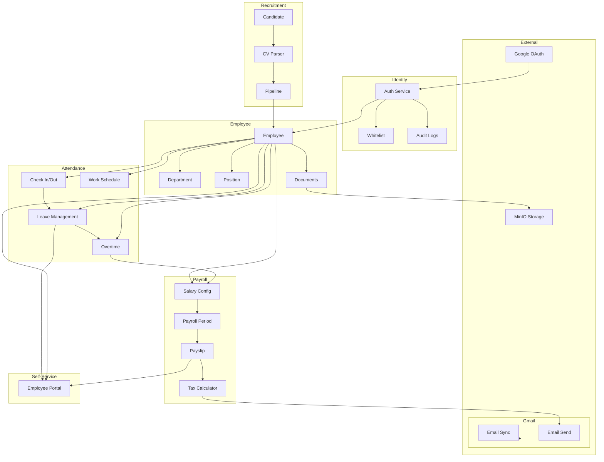

# Cross-Module Data Flow

Tài liệu này mô tả luồng dữ liệu giữa các modules trong hệ thống Vroom HR.

## Tổng quan luồng dữ liệu



---

## Chi tiết từng luồng

### 1. Auth Flow → Employee Creation

```
[User clicks "Login with Google"]
         │
         ▼
[Google OAuth2] ──► /api/identity/auth/google
         │
         ▼
[Check whitelist] ──► whitelist_entries table
         │
    ┌────┴────┐
    │         │
 NOT IN    IN WHITELIST
    │         │
    ▼         ▼
 REJECT    Create/Update User
    │         │
    │         ▼
    │    [Link to Employee]
    │         │
    │         ▼
    └──────► JWT Cookie
              │
              ▼
        [Access Token]
```

**Modules involved:** identity → employee

**Database tables:** users, whitelist_entries, employees

---

### 2. Recruitment → Employee Promotion

```
[Candidate applies]
         │
         ▼
[Upload CV] ──► MinIO Storage
         │
         ▼
[AI CV Parsing] (OpenAI)
         │
         ▼
[Candidate Record] ──► candidates table
         │
         ▼
[Pipeline Stages] ──► pipeline_stages
    (Application → Interview → Offer → Hired)
         │
         ▼
[Promote to Employee]
    - Create employee record
    - Link to user
    - Assign department/position
    - Create leave balance
         │
         ▼
[Employee Created]
```

**Modules involved:** recruitment → employee → attendance (leave balance)

**Database tables:** candidates, candidate_cv, recruitment_pipeline, pipeline_stages, employees, leave_balances

---

### 3. Attendance → Payroll

```
[Employee checks in]
         │
         ▼
[attendance_records] ──► check_in, check_out, work_hours
         │
         ▼
[Leave Request] ──► leave_requests
    (Annual leave, sick leave, etc.)
         │
         ▼
[Overtime Request] ──► overtime_requests
         │
         ▼
[Payroll Processing]
    - Calculate work days
    - Calculate overtime hours
    - Calculate leave deductions
         │
         ▼
[payslips] ──► gross_salary, tax_amount, insurance_amount, net_salary
```

**Modules involved:** attendance → payroll

**Database tables:** attendance_records, leave_requests, overtime_requests, leave_balances, salary_configs, payslips

---

### 4. Payslip Generation Flow

```
[HR triggers payroll period]
         │
         ▼
[payroll_periods] ──► start_date, end_date
         │
         ▼
[For each employee]
    │
    ├─► Get basic_salary (from position_salaries)
    │
    ├─► Get allowances (from allowances table)
    │
    ├─► Calculate work days from attendance_records
    │
    ├─► Calculate overtime hours from overtime_requests
    │
    ├─► Calculate leave deductions from leave_requests
    │
    ├─► Calculate tax (Vietnamese progressive tax)
    │    - Personal deduction: 11M VND/month
    │    - Dependent deduction: 4.4M VND/person
    │
    ├─► Calculate insurance (10.5% employee portion)
    │    - BHXH: 8%
    │    - BHYT: 1.5%
    │    - BHTN: 1%
    │
    └─► Generate payslip
         │
         ▼
[payslips table] ──► Store calculation results
         │
         ▼
[Email payslip] ──► Send via Gmail API
```

**Modules involved:** payroll → gmail

**Database tables:** payroll_periods, position_salaries, allowances, attendance_records, overtime_requests, leave_requests, dependents, payslips

---

### 5. Self-Service (ESS) Data Flow

```
[Employee logs in]
         │
         ▼
[See own profile] ──► employees + users JOIN
         │
         ▼
[View attendance] ──► attendance_records
         │
         ▼
[View leave balance] ──► leave_balances + leave_types
         │
         ▼
[Request leave] ──► leave_requests
         │
         ▼
[Request overtime] ──► overtime_requests
         │
         ▼
[View payslip] ──► payslips (own employee_id)
```

**Modules involved:** employee → attendance → payroll → self_service

**Database tables:** users, employees, attendance_records, leave_balances, leave_types, leave_requests, overtime_requests, payslips

---

## Cross-Module Queries

### Employee with all related data

```sql
-- Get employee with department, position, user info
SELECT
    e.*,
    u.email,
    u.name,
    u.avatar_url,
    d.name as department_name,
    p.name as position_name
FROM employees e
JOIN users u ON e.user_id = u.id
LEFT JOIN departments d ON e.department_id = d.id
LEFT JOIN positions p ON e.position_id = p.id
WHERE e.id = :employee_id;
```

### Attendance summary for payroll

```sql
-- Get work hours for a period
SELECT
    employee_id,
    SUM(work_hours) as total_hours,
    COUNT(*) as total_days
FROM attendance_records
WHERE date BETWEEN :start_date AND :end_date
GROUP BY employee_id;
```

### Payslip calculation components

```sql
-- Get all payslip components
SELECT
    ps.*,
    e.employee_code,
    e.full_name,
    ps.basic_salary,
    (ps.allowances->>'total')::numeric as total_allowances,
    (ps.deductions->>'total')::numeric as total_deductions
FROM payslips ps
JOIN employees e ON ps.employee_id = e.id
WHERE ps.period_id = :period_id;
```

---

## Data Consistency Rules

1. **Employee → User:** Mỗi employee phải có user_id link đến users table
2. **Department → Position:** Position phải có department_id (nullable cho admin roles)
3. **Employee → Leave Balance:** Mỗi năm phải có leave_balances cho mỗi leave_type
4. **Payroll Period:** Payslips chỉ được tạo cho payroll_periods đang ở trạng thái "processing"
5. **Attendance:** attendance_records phải có date trong khoảng employee hire_date và today

---

## Event-Driven Updates (Future)

Hiện tại hệ thống dùng synchronous calls. Trong tương lai có thể implement event-driven:

```
Candidate promoted → Event: candidate.promoted → Employee Service creates employee
Employee created → Event: employee.created → Leave Service creates leave balance
Payroll processed → Event: payroll.completed → Email Service sends payslip
```

Điều này sẽ giảm coupling giữa các modules.
